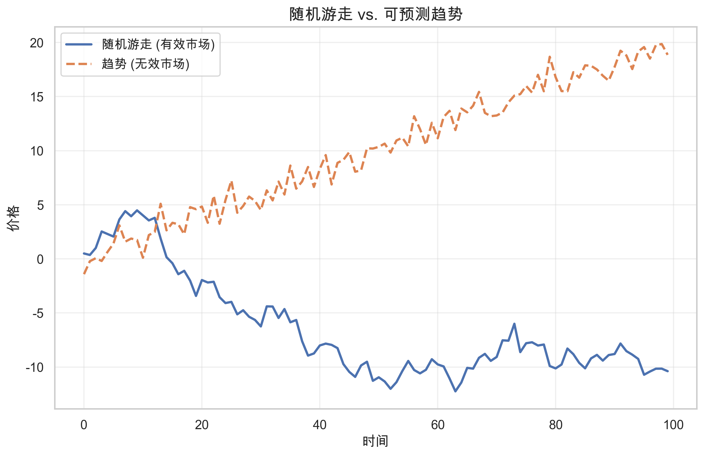
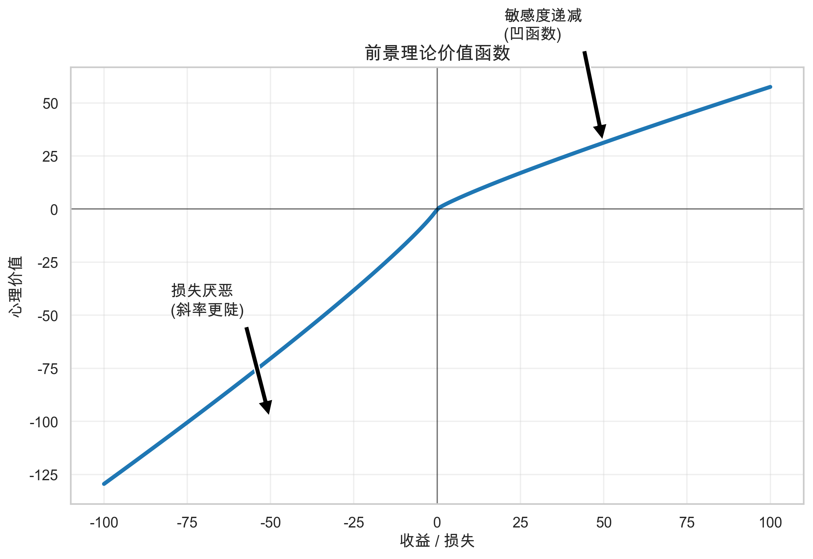
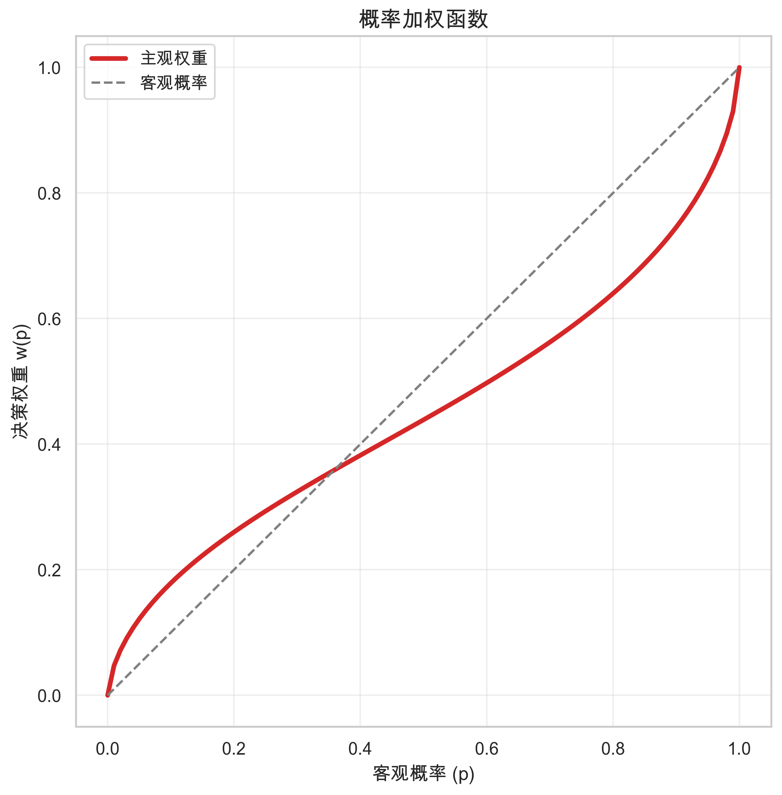
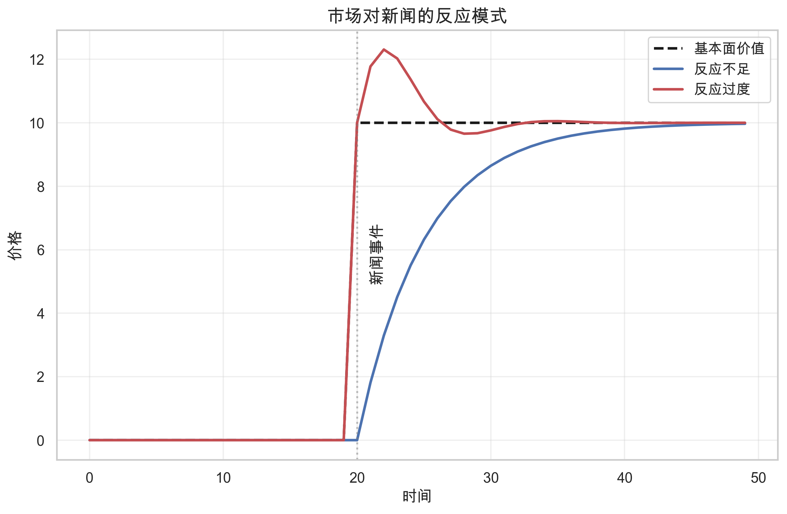

# 第二章：行为金融

> **核心问题**：人们如何系统性地犯错？这些错误如何影响市场价格？
> **前置阅读**：[01. 有效市场假说](01_efficient_market_hypothesis.md)

---

## 核心概念定义

### 什么是有效市场假说？



**有效市场假说 (Efficient Market Hypothesis, EMH)** 认为，如果在一个市场中，价格完全反映了所有可获得的信息，那么这个市场就是有效的。

### 什么是行为金融？

**行为金融 (Behavioral Finance)** 是将心理学引入金融学的研究领域，研究投资者的非理性行为如何影响市场价格。

**与传统金融理论的核心区别**：

| 维度 | 传统金融（EMH） | 行为金融 |
|-----|----------------|---------|
| 投资者假设 | 完全理性 | 有限理性，存在系统性偏差 |
| 错误性质 | 随机噪声，相互抵消 | 系统性的，可预测的方向性错误 |
| 市场价格 | 始终反映真实价值 | 可能持续偏离真实价值 |
| Alpha 来源 | 不存在 | 来自他人的系统性错误 |

**通俗解释**：

传统理论认为投资者的错误像掷骰子——有人高估，有人低估，最终相互抵消，价格还是对的。

行为金融发现：人们的错误是有方向的——大多数人在同样的情境下会犯同样的错误。当大家一起犯错时，价格就会系统性地偏离真实价值。

### 本章结构

```
一、理论基础：前景理论
         ↓
二、认知偏差：具体的心理错误
         ↓
三、市场反应模式：反应不足与反应过度
         ↓
四、可观测的市场现象：动量、反转、价值效应等
```

---

## 一、理论基础：前景理论

### 理论背景

传统经济学假设人们按照**期望效用理论**做决策：
- 理性计算每个选项的期望收益
- 选择期望收益最高的选项
- 对收益和损失的态度是对称的

Daniel Kahneman 和 Amos Tversky 在 1979 年发表的**前景理论 (Prospect Theory)** 彻底颠覆了这一假设，Kahneman 因此获得 2002 年诺贝尔经济学奖。

### 1. 损失厌恶 (Loss Aversion)



**核心发现**：损失带来的痛苦约为同等收益带来快乐的 **2-2.5 倍**。

#### 经典实验

> 你愿意接受以下赌博吗？
> - 50% 概率赢 150 元
> - 50% 概率亏 100 元

期望收益是正的（+25元），但大多数人拒绝。因为亏 100 元的痛苦超过了赢 150 元的快乐。

**损失厌恶系数**：实验表明，损失的心理权重约为收益的 2-2.5 倍。即：

```
心理感受 ≈ 收益 × 1 - 损失 × 2.25

例如：
  赚 100 元的快乐 ≈ +100
  亏 100 元的痛苦 ≈ -225
  净感受 = -125（即使盈亏相等，心理上仍是负的）
```

#### 损失厌恶的神经科学基础

fMRI 研究发现，损失和收益激活大脑的不同区域：
- **收益**：激活腹侧纹状体（奖励中心）
- **损失**：激活杏仁核（恐惧中心）和前脑岛（厌恶中心）

损失激活的大脑区域与生存本能相关——这可能解释了为什么损失厌恶如此根深蒂固，难以通过"理性思考"克服。

#### 损失厌恶在市场中的表现

**1. 个人投资者层面**

| 行为 | 机制 | 后果 |
|-----|------|------|
| 不愿"割肉" | 卖出亏损股票会让损失"变成真的" | 持有亏损股票过久 |
| 过早"止盈" | 害怕已有的盈利消失 | 错过后续上涨 |
| 风险偏好逆转 | 亏损时反而更愿意冒险（赌一把回本） | 越亏越赌，损失扩大 |

**风险偏好逆转的例子**：

```
情境 A（盈利状态）：
  你已经赚了 1000 元，选择：
  a) 确定再赚 500 元
  b) 50% 概率再赚 1000 元，50% 概率什么都没有
  → 大多数人选 a（风险规避）

情境 B（亏损状态）：
  你已经亏了 1000 元，选择：
  a) 确定再亏 500 元
  b) 50% 概率再亏 1000 元，50% 概率不亏
  → 大多数人选 b（风险寻求）
```

这解释了为什么很多投资者在亏损时不愿止损，反而加仓"摊低成本"。

**2. 市场整体层面**

| 现象 | 损失厌恶的作用 |
|-----|---------------|
| 股权溢价之谜 | 投资者要求过高的风险补偿，因为他们高估了损失的痛苦 |
| 下跌时波动更大 | 损失引发恐慌，卖出行为更剧烈 |
| 整数关口阻力 | 在成本价附近，卖出意愿急剧变化 |
| 周五效应 | 投资者不愿带着亏损过周末 |

**股权溢价之谜 (Equity Premium Puzzle)**：

历史上，股票年化收益比债券高约 6%，这个差距用传统风险理论难以解释。

Benartzi & Thaler (1995) 用**短视损失厌恶 (Myopic Loss Aversion)** 解释：
- 投资者频繁查看账户（如每天或每月）
- 短期内股票波动大，经常出现亏损
- 损失厌恶让投资者高估了股票的"痛苦"
- 因此要求更高的收益补偿

**实证**：查看账户越频繁的投资者，股票配置比例越低。

**3. 公司决策层面**

损失厌恶不仅影响个人，也影响公司管理层：

| 决策 | 损失厌恶的影响 |
|-----|---------------|
| 盈利预期管理 | 公司宁愿给保守指引，也不愿"miss"预期 |
| 裁员决策 | 管理层推迟裁员，因为裁员被视为"承认失败" |
| 项目终止 | 亏损项目被继续投入（沉没成本谬误） |
| 并购整合 | 失败的并购迟迟不愿剥离 |

#### 如何利用损失厌恶

**利用他人的损失厌恶**：

| 策略 | 逻辑 |
|-----|------|
| 成本价策略 | 关注股价接近前期高点/大量成交区的股票 |
| 52 周高点 | 股价突破 52 周高点后，前期"被套"的投资者解套卖出，之后卖压减轻 |
| 大宗交易折价 | 被迫卖出的投资者（如爆仓、赎回）愿意接受折价 |

**克服自己的损失厌恶**：

1. **降低查看频率**：减少看账户的次数，避免短视损失厌恶
2. **预先设定规则**：在买入前设定止损点，避免临时决策
3. **关注组合而非个股**：单只股票亏损不重要，组合整体表现才重要
4. **重新框架**：把"亏损 10%"想成"还剩 90%"
5. **接受小亏损**：频繁的小亏损好过偶尔的大亏损

### 2. 参考点依赖 (Reference Dependence)

**核心发现**：人们评估的是相对于某个参考点的变化，而非绝对水平。

**例子**：
- 情境 A：你的股票从 100 元涨到 150 元
- 情境 B：你的股票从 200 元跌到 150 元

两种情境下你都拥有价值 150 元的股票，但感受完全不同。A 情境你感到快乐，B 情境你感到痛苦。

**常见的参考点**：

| 参考点类型 | 市场现象 |
|-----------|---------|
| 买入成本 | 投资者在成本价附近行为异常 |
| 52 周高点 | 股价突破历史高点后往往继续上涨 |
| 整数价格 | 股价在整数关口存在"心理阻力" |

**实证**：George & Hwang (2004) 发现，接近 52 周高点的股票具有显著的预测能力——投资者对好消息反应不足，因为他们锚定在历史高点。

### 3. 概率扭曲 (Probability Weighting)



**核心发现**：人们高估小概率事件，低估大概率事件。

```
实际概率    心理感知
1%    →    约 5%（高估 5 倍）
10%   →    约 15%
50%   →    约 50%（相对准确）
90%   →    约 75%（低估）
99%   →    约 90%（低估）
```

**日常例子**：
- 买彩票（高估极小的中奖概率）
- 恐惧飞行（高估极小的坠机概率，实际上开车更危险）

**市场影响——彩票型股票被高估**：

投资者对"小概率大收益"的股票过度追捧：
- 低价股、概念股、ST 股
- 这些股票有极小概率暴涨，但大概率表现平平或下跌
- 因为投资者高估了暴涨的概率，愿意支付过高的价格

**实证**：Bali, Cakici & Whitelaw (2011) 发现，过去一个月最大单日涨幅最高的股票，未来平均收益显著为负。

### 4. 框架效应 (Framing Effect)

**核心发现**：同一信息的不同表述方式会导致不同的决策。

**经典例子**：
- "这只股票有 70% 的概率盈利"
- "这只股票有 30% 的概率亏损"

信息完全相同，但前者让人更愿意买入。

**市场影响**：
- 公司倾向于用正面框架发布消息
- 分析师倾向于用正面框架推荐股票
- 投资者对同一信息的反应取决于如何被"框架"

---

## 二、认知偏差

人的大脑不是完美的计算机，而是充满"快捷方式"（启发式）的系统。这些快捷方式在日常生活中通常有效，但在金融市场中会导致系统性错误。

### 1. 过度自信 (Overconfidence)

**定义**：高估自己判断的准确性，低估不确定性。

**三种表现形式**：

| 类型 | 表现 | 例子 |
|-----|------|------|
| **过度精确** | 预测区间过窄 | "股价一定在 95-105 之间" |
| **过度乐观** | 高估自己成功的概率 | "我能战胜市场" |
| **控制幻觉** | 认为自己能控制随机事件 | "我选的号码更容易中奖" |

**市场影响——交易过度**：

过度自信导致投资者交易过于频繁，而频繁交易会：
- 产生更多交易成本
- 更容易追涨杀跌
- 降低长期收益

**实证**：Barber & Odean (2000) 分析 78,000 个散户账户发现：
- 交易最频繁的 20% 投资者，年化收益比交易最少的 20% 低 6.5%
- 男性比女性交易更频繁（过度自信更强），收益也更低

### 2. 代表性偏差 (Representativeness Bias)

**定义**：根据"像不像"来判断概率，而非根据真实的统计概率。

**经典例子**：

> 小明，35 岁，内向、细致、喜欢数学。
> 他更可能是：A. 图书管理员  B. 销售员

大多数人选 A，因为描述"像"图书管理员。但销售员的人数是图书管理员的几十倍，从概率上说 B 更可能。

**市场影响——趋势外推**：

- 看到股票连续上涨，就认为它会继续上涨（"像"好股票）
- 看到公司过去几年业绩好，就认为未来也会好
- **忽略了均值回归的统计规律**

这是导致**反应过度**的重要原因。

### 3. 锚定效应 (Anchoring)

**定义**：过度依赖最先获得的信息（锚点），调整不足。

**经典实验**：
- 先让受试者看一个随机数字（如 65 或 10）
- 然后问：非洲国家在联合国的占比是多少？
- 看到 65 的人平均猜 45%，看到 10 的人平均猜 25%
- 一个完全无关的数字影响了判断

**市场影响**：

| 锚点 | 影响 |
|-----|------|
| 买入价格 | 影响卖出决策，不愿亏本卖出 |
| 历史目标价 | 分析师调整预测时幅度不足 |
| 历史高点/低点 | 投资者对新信息反应不足 |

**例子**：
- 股票从 100 元跌到 50 元
- 投资者认为"便宜了一半"，值得买入
- 但 100 元可能本来就是高估的

这是导致**反应不足**的重要原因。

### 4. 保守偏差 (Conservatism Bias)

**定义**：对新信息的反应不足，过度坚持原有观点。

**与锚定的区别**：
- 锚定：被某个数字影响
- 保守偏差：对新信息更新不足

**市场影响**：
- 好消息出来后，投资者不愿意大幅上调预期
- 坏消息出来后，投资者不愿意大幅下调预期
- 价格调整是渐进的，而非一步到位

这也是导致**反应不足**和**动量效应**的原因之一。

### 5. 确认偏差 (Confirmation Bias)

**定义**：选择性地关注支持自己已有观点的信息，忽略相反的信息。

**例子**：
- 你看好某只股票后，只关注利好消息，忽略利空
- 你认为市场要涨，就只看多头分析师的报告
- 即使出现明显的反向信号，你也会找理由解释为什么"这次不一样"

**市场影响**：
- 投资者持有亏损股票时更容易产生确认偏差
- 泡沫可以持续膨胀——乐观者只看乐观的信息
- 导致对新信息反应不足

### 6. 可得性偏差 (Availability Bias)

**定义**：容易想到的事件被认为更可能发生。

**例子**：
- 看了空难新闻后，高估飞行危险
- 听说朋友炒股赚钱后，高估炒股成功概率
- 市场暴跌后，高估未来暴跌概率

**市场影响**：
- 近期发生的事件对投资者影响过大
- 媒体高度报道的事件被高估
- 可能导致对近期事件**反应过度**

---

## 三、市场反应模式



认知偏差会导致两种基本的市场反应模式：

### 反应不足 (Underreaction)

**定义**：市场对新信息的反应不够充分，价格调整不到位。

**导致反应不足的偏差**：

| 偏差 | 机制 |
|-----|------|
| 锚定效应 | 被旧价格锚定，不愿大幅调整 |
| 保守偏差 | 对新信息更新不足 |
| 确认偏差 | 忽略与原有观点相反的信息 |

**市场表现**：

```
好消息发布
    ↓
价格应该涨 10%
    ↓
但实际只涨 5%（反应不足）
    ↓
接下来几周/月逐渐涨到应有水平
    ↓
形成"动量"
```

### 反应过度 (Overreaction)

**定义**：市场对信息反应过于剧烈，价格偏离过大。

**导致反应过度的偏差**：

| 偏差 | 机制 |
|-----|------|
| 代表性偏差 | 过度外推过去的趋势 |
| 可得性偏差 | 近期事件影响过大 |
| 过度自信 | 对自己的判断过于确信 |

**市场表现**：

```
连续利好/股价持续上涨
    ↓
投资者外推趋势（"它会继续涨"）
    ↓
价格涨到远超基本面的水平（反应过度）
    ↓
最终回归基本面
    ↓
形成"长期反转"
```

### 两种模式的时间尺度

| 时间尺度 | 主导模式 | 现象 |
|---------|---------|------|
| 短期（1-12个月） | 反应不足 | 动量效应 |
| 长期（3-5年） | 反应过度 | 长期反转 |

**为什么是这样？**

- **短期**：新信息刚出来，锚定和保守偏差占主导
- **长期**：趋势持续久了，代表性偏差和过度外推占主导

---

## 四、可观测的市场现象

认知偏差和反应模式最终表现为可以被实证观察和利用的市场现象。

### 1. 动量效应 (Momentum)

**现象**：过去 3-12 个月表现好的股票，未来 3-12 个月继续表现好。

#### 关键研究

**Jegadeesh & Titman (1993)** 是动量效应的奠基性研究：
- 买入过去 12 个月的赢家，卖出输家
- 年化超额收益约 8-12%
- 在不同市场、不同时期都存在

这个发现被称为"金融学最令人困惑的异象"——它直接挑战了有效市场假说，且难以用风险解释。

#### 动量策略的参数

动量效应的强度取决于**形成期**（看过去多久）和**持有期**（持有多久）：

| 形成期 | 持有期 | 典型年化超额收益 | 说明 |
|-------|-------|-----------------|------|
| 1 个月 | 1 个月 | 负收益 | 短期反转，不是动量 |
| 3-6 个月 | 3-6 个月 | 6-8% | 中等强度 |
| 6-12 个月 | 3-6 个月 | 8-12% | 经典配置，效果最好 |
| 12 个月 | 12 个月 | 5-7% | 持有期过长，收益下降 |

**实践中常用的配置**：
- 形成期：过去 12 个月（通常跳过最近 1 个月，避免短期反转）
- 持有期：3-6 个月
- 调仓频率：月度

#### 行为解释

```
好消息发布
    ↓
锚定效应 + 保守偏差
    ↓
投资者反应不足
    ↓
价格逐渐上涨（而非一步到位）
    ↓
过去的赢家继续上涨
    ↓
动量效应
```

**具体机制**：

| 偏差 | 如何产生动量 |
|-----|-------------|
| 锚定效应 | 投资者被旧价格锚定，对新信息反应不足 |
| 保守偏差 | 不愿大幅更新预期 |
| 确认偏差 | 持有者只关注利好，忽视利空 |
| 处置效应 | 赢家被过早卖出，抑制上涨速度 |

#### 跨资产类别的证据

动量效应不仅存在于个股，还存在于几乎所有资产类别：

| 资产类别 | 研究证据 | 年化超额收益 |
|---------|---------|-------------|
| 美股个股 | Jegadeesh & Titman (1993) | 8-12% |
| 国际股市 | Rouwenhorst (1998) | 6-10% |
| 行业/板块 | Moskowitz & Grinblatt (1999) | 5-8% |
| 国债 | Asness et al. (2013) | 3-5% |
| 外汇 | Menkhoff et al. (2012) | 4-6% |
| 商品期货 | Erb & Harvey (2006) | 5-8% |

**重要发现**：不同资产类别的动量策略之间相关性较低，组合使用可以分散风险。

#### 动量崩溃 (Momentum Crash)

动量策略有一个致命弱点：**在市场剧烈波动时可能遭遇毁灭性损失**。

**历史上的动量崩溃**：

| 时期 | 动量策略损失 | 背景 |
|-----|-------------|------|
| 1932 年 | -91% | 大萧条反弹 |
| 2009 年 3-5 月 | -73% | 金融危机后反弹 |
| 2020 年 11 月 | -39% | 疫苗消息后反弹 |

**崩溃的机制**：

```
熊市中：
    防御股（公用事业、消费）成为"赢家"
    周期股（金融、工业）成为"输家"
        ↓
市场突然反转（如政策刺激、疫苗消息）
        ↓
输家暴涨，赢家滞涨
        ↓
动量策略：持有滞涨的赢家，做空暴涨的输家
        ↓
双向亏损 → 动量崩溃
```

**为什么崩溃如此剧烈？**

1. **输家的 Beta 更高**：熊市中的输家往往是高 Beta 股票，反弹时涨得更猛
2. **做空挤压**：大量做空输家的资金被迫平仓，加剧上涨
3. **杠杆放大**：动量策略通常使用杠杆，损失被放大

**应对策略**：
- 动态调整敞口：在市场波动率高时减少仓位
- 结合其他因子：与价值、质量因子组合
- 设置止损：限制单次最大损失

#### 动量效应为什么持续存在？

如果动量效应这么明显，为什么没有被套利消除？

| 原因 | 解释 |
|-----|------|
| 崩溃风险 | 动量崩溃可能一次亏光多年收益 |
| 高换手率 | 频繁调仓产生大量交易成本 |
| 容量限制 | 大资金难以快速建仓/平仓 |
| 行为持续 | 导致动量的心理偏差不会消失 |

这也解释了为什么动量效应在小盘股中更强——机构资金难以进入。

### 2. 长期反转 (Long-term Reversal)

**现象**：过去 3-5 年表现极好/极差的股票，未来表现相反。

**关键研究**：De Bondt & Thaler (1985)
- 过去 3 年的极端输家，未来 3 年跑赢极端赢家约 25%
- 被称为"赢家诅咒"和"输家祝福"

**行为解释**：

```
股票连续多年上涨
    ↓
代表性偏差
    ↓
投资者外推趋势（"它会继续涨"）
    ↓
价格被推到远超基本面
    ↓
最终回归基本面
    ↓
长期反转
```

**与动量的关系**：

| 时间 | 现象 | 原因 |
|-----|------|------|
| 短期（1-12月） | 动量 | 反应不足 |
| 长期（3-5年） | 反转 | 反应过度后的修正 |

### 3. 价值效应 (Value Effect)

**现象**：低估值（低 P/B、低 P/E）股票长期跑赢高估值股票。

#### 关键研究

**Fama & French (1992)** 的发现：
- 低 P/B 组合年化跑赢高 P/B 组合约 4-5%
- 这个效应持续了数十年
- 在不同国家市场都存在

**常用的价值指标**：

| 指标 | 定义 | 低值意味着 |
|-----|------|-----------|
| P/B | 股价 / 每股净资产 | 资产被低估 |
| P/E | 股价 / 每股收益 | 盈利被低估 |
| P/S | 股价 / 每股销售额 | 销售被低估 |
| P/CF | 股价 / 每股现金流 | 现金流被低估 |
| EV/EBITDA | 企业价值 / 息税折旧前利润 | 运营能力被低估 |

#### 行为解释

| 偏差 | 机制 |
|-----|------|
| 代表性偏差 | 过去业绩差的公司被认为未来也会差 |
| 过度外推 | 将近期的差业绩外推到遥远的未来 |
| 可得性偏差 | 负面消息更容易被记住 |

**机制**：

```
公司业绩下滑
    ↓
负面消息频繁报道
    ↓
投资者过度悲观（代表性偏差 + 可得性偏差）
    ↓
价格被压得过低
    ↓
当业绩没有想象的那么差时
    ↓
价格修复，产生超额收益
```

#### 价值陷阱 (Value Trap)

低估值不等于好投资。**价值陷阱**是指看起来便宜但实际上持续下跌的股票。

**价值陷阱的特征**：

| 特征 | 说明 | 例子 |
|-----|------|------|
| 结构性衰退 | 行业被新技术颠覆 | 传统零售 vs 电商 |
| 财务恶化 | 负债过高，现金流枯竭 | 高杠杆房企 |
| 治理问题 | 大股东掏空，信息不透明 | 财务造假公司 |
| 竞争劣势 | 市场份额持续流失 | 被边缘化的品牌 |

**如何识别价值陷阱？**

```
真正的价值股：
    低估值 + 稳定/改善的基本面 + 合理的负债
        ↓
    等待市场情绪修复
        ↓
    估值回归 → 超额收益

价值陷阱：
    低估值 + 恶化的基本面 + 高负债
        ↓
    "便宜"是因为市场正确定价了风险
        ↓
    估值可能更低 → 亏损
```

**实践中的筛选方法**：

| 指标 | 用途 | 筛选条件 |
|-----|------|---------|
| 盈利质量 | 排除财务造假 | 经营现金流 > 净利润 |
| 负债水平 | 排除财务风险 | 资产负债率 < 60% |
| 盈利趋势 | 排除持续恶化 | 近期盈利不连续大幅下滑 |
| 行业前景 | 排除结构性衰退 | 避免被颠覆的行业 |

#### 价值效应近年"失效"了吗？

2010 年代，价值策略表现显著落后于成长策略，引发了"价值已死"的讨论。

**2007-2020 年的表现**：

| 时期 | 价值 vs 成长 | 背景 |
|-----|-------------|------|
| 2007-2009 | 价值大幅跑输 | 金融危机，银行股（价值股）暴跌 |
| 2010-2020 | 价值持续跑输 | 科技股（成长股）主导市场 |
| 2020-2021 | 价值短暂跑赢 | 疫情后复苏，周期股反弹 |
| 2022 | 价值大幅跑赢 | 加息周期，成长股杀估值 |

**为什么价值效应会阶段性"失效"？**

| 解释 | 内容 |
|-----|------|
| 低利率环境 | 低利率利好成长股（未来现金流折现值更高） |
| 无形资产 | 科技公司资产以无形资产为主，P/B 指标失真 |
| 赢家通吃 | 平台经济下，龙头公司享受更高估值溢价 |
| 拥挤交易 | 价值因子被过度使用，超额收益被竞争掉 |

**价值投资者的教训**：

> **价值效应是长期规律，但"长期"可能比你的耐心更长。**

- 单一因子的表现可能持续数年不佳
- 需要与其他因子（如质量、动量）组合使用
- 估值指标需要随市场演变而调整

#### 价值 + 质量：更稳健的组合

单纯的低估值容易落入价值陷阱。结合**质量因子**可以提高胜率。

**质量因子的常用指标**：

| 指标 | 衡量内容 |
|-----|---------|
| ROE | 盈利能力 |
| 毛利率 | 竞争优势 |
| 资产负债率 | 财务稳健性 |
| 盈利稳定性 | 业务可预测性 |
| 应计比例 | 盈利质量 |

**组合策略**：

```
价值 + 质量 = 便宜的好公司

筛选条件：
    低 P/B 或低 P/E（便宜）
    + 高 ROE（盈利能力强）
    + 低负债（财务稳健）
    + 稳定盈利（业务可预测）
```

Novy-Marx (2013) 发现，高毛利率的价值股表现远好于低毛利率的价值股。

### 4. 处置效应 (Disposition Effect)

**现象**：投资者倾向于过早卖出盈利股票，过晚卖出亏损股票。

**关键研究**：Odean (1998)
- 分析 10,000 个散户账户
- 投资者卖出盈利股的概率比卖出亏损股高 50%

**行为解释**：

```
损失厌恶
    ↓
亏损带来的痛苦 > 盈利带来的快乐
    ↓
持有亏损股票：不愿"实现"痛苦，期待回本
卖出盈利股票：想"锁定"快乐，避免回吐
    ↓
处置效应
```

**例子**：
- 你持有两只股票：A 盈利 20%，B 亏损 20%
- 需要用钱，必须卖一只
- 大多数人选择卖 A，保留 B
- 但理性做法是：卖掉预期较差的那只，与当前盈亏无关

**市场影响**：
- 赢家股票面临卖压，上涨速度被抑制
- 输家股票缺乏卖压，下跌速度被抑制
- 这加强了动量效应（赢家继续慢慢涨）

### 5. 均值回归 (Mean Reversion)

**现象**：极端表现（无论好坏）往往会向平均水平回归。

#### 什么是均值回归？

**均值回归 (Mean Reversion)** 是指任何偏离长期平均水平的变量，都有回归到平均水平的趋势。

**生活中的例子**：
- 身高极高的父母，子女身高往往低于父母（向人口平均身高回归）
- 考试发挥超常的学生，下次成绩往往不如这次好
- 球星某赛季表现特别出色后，下赛季通常会回落

Francis Galton 在 1886 年首次发现这个规律，称之为"回归平庸"(Regression to Mediocrity)。

#### 均值回归的两个层面

**1. 统计层面：随机波动的自然特性**

极端值往往包含较多的随机成分。当随机成分消退，表现自然回归平均。

**例子**：
- 某基金经理今年收益 50%
- 其中 15% 是能力，35% 是运气（市场环境、选股碰巧踩中热点）
- 明年运气成分大概率不会重复
- 收益回归到接近能力水平（15% 左右）

**2. 经济层面：竞争和资本的自然调节**

| 情况 | 调节机制 | 结果 |
|-----|---------|------|
| 企业盈利过高 | 吸引竞争者进入 | 利润率下降 |
| 企业盈利过低 | 弱者退出，供给减少 | 利润率上升 |
| 行业估值过高 | 资本涌入推高供给 | 估值下降 |
| 行业估值过低 | 资本流出减少供给 | 估值上升 |

#### 行为偏差如何放大均值回归

均值回归本身是自然规律，但行为偏差会**放大**这个过程：

```
正常均值回归：
    真实价值 = 100
    价格上涨到 120（高估 20%）
    逐渐回归到 100

被行为放大后：
    真实价值 = 100
    价格上涨到 150（代表性偏差 → 外推趋势）
    回归时跌到 80（反应过度 → 过度悲观）
    最终回到 100
```

**导致放大的偏差**：

| 偏差 | 如何放大均值回归 |
|-----|-----------------|
| 代表性偏差 | 好表现被外推 → 价格偏离更远 |
| 过度自信 | 相信趋势会持续 → 追涨杀跌 |
| 可得性偏差 | 近期表现主导判断 → 忽视长期均值 |
| 锚定效应 | 被近期高/低点锚定 → 判断失准 |

#### 实证证据

**1. 盈利的均值回归**

Fama & French (2000) 研究显示：
- 企业盈利能力（ROE）强烈均值回归
- 当前 ROE 最高的公司，未来 ROE 下降最多
- 当前 ROE 最低的公司，未来 ROE 上升最多

| 当前 ROE 组 | 5年后 ROE 变化 |
|------------|---------------|
| 最高 20% | 平均下降 8-10% |
| 最低 20% | 平均上升 5-8% |

**2. 估值的均值回归**

- 整体市场的 P/E、P/B 会回归历史平均
- Campbell & Shiller (1998)：CAPE（周期调整市盈率）高于均值时，未来 10 年收益低于平均
- 行业估值同样如此——热门行业估值终会回落，冷门行业估值终会修复

**3. 收益的均值回归**

De Bondt & Thaler (1985) 的发现本质上就是收益的均值回归：
- 过去 3 年涨幅最大的股票 → 未来 3 年涨幅最小
- 过去 3 年跌幅最大的股票 → 未来 3 年涨幅最大

#### 均值回归的时间尺度

不同变量的回归速度不同：

| 变量 | 典型回归周期 | 说明 |
|-----|-------------|------|
| 股价收益 | 3-5 年 | 长期反转现象 |
| 企业盈利 | 5-7 年 | 竞争调节需要时间 |
| 行业估值 | 5-10 年 | 资本周期较长 |
| 市场整体估值 | 10-15 年 | 受宏观周期影响 |

**重要提醒**：均值回归需要时间，短期内极端可能变得更极端。

#### 与其他效应的关系

| 效应 | 与均值回归的关系 |
|-----|-----------------|
| 长期反转 | 股价收益的均值回归 |
| 价值效应 | 估值的均值回归——低估值回归意味着超额收益 |
| 动量效应 | 均值回归的"前奏"——价格尚未开始回归的阶段 |

**例子：价值效应如何源于均值回归**

```
某股票：
    历史平均 P/E = 15
    当前 P/E = 8（因为近期业绩差，被过度悲观）

如果 P/E 回归到 15：
    即使盈利不变，股价也要上涨 87.5%
    这就是"价值效应"的收益来源
```

#### 实践启示

**1. 警惕"永远"的判断**

当你听到以下说法时要警惕：
- "这家公司会永远高增长"
- "这个行业已经彻底没希望了"
- "这次不一样"

大多数情况下，好的会变差，差的会变好。

**2. 均值回归不是即时的**

- 均值回归是长期规律，不是交易信号
- 短期内，趋势可能持续甚至加强
- 不要过早抄底或逃顶

**3. 识别"均值"本身**

均值回归的前提是知道"均值"是什么：
- 用足够长的历史数据
- 考虑结构性变化（均值本身可能在移动）
- 区分周期性波动和结构性改变

---

## 行为解释 vs 风险解释

**学术争议**：这些现象是行为偏差还是风险补偿？

| 现象 | 行为解释 | 风险解释 |
|-----|---------|---------|
| 动量 | 反应不足 | 动量股承担某种风险 |
| 价值 | 过度悲观 | 低估值公司财务困境风险高 |

**对量化的启示**：

不管是哪种解释，这些现象都可以被利用。但理解来源有助于判断持续性：
- 如果是行为偏差 → 可能随着投资者学习而减弱
- 如果是风险补偿 → 可能长期持续，但需要承担相应风险

---

## 实证证据

### 个人投资者的行为研究

**Barber & Odean 的系列研究**（基于美国券商数据）：

| 发现 | 数据来源 | 结论 |
|-----|---------|------|
| 交易越多，收益越差 | 78,000 个账户 | 年化少赚 6.5% |
| 男性交易更多 | 35,000 个账户 | 男性年化少赚 1.4% |
| 买入的股票跑输卖出的 | 10,000 个账户 | 12 个月后跑输 3.3% |

### 机构投资者也有偏差

机构投资者虽然更专业，但同样存在行为偏差：

| 偏差 | 机构表现 |
|-----|---------|
| 羊群效应 | 机构倾向于买入其他机构买入的股票 |
| 处置效应 | 基金经理也过早卖出盈利股 |
| 过度自信 | 主动基金经理普遍高估自己的能力 |

---

## 行为金融的局限

行为金融解释了**为什么**会有错误定价，但没有回答一个关键问题：

> 如果存在系统性的错误定价，为什么聪明的套利者不会消除它？

这个问题引出了下一章的主题：**限制套利**。

---

## 对量化交易的启示

### 1. 利用他人的行为偏差

| 偏差/现象 | 策略方向 |
|----------|---------|
| 反应不足 / 动量 | 买入近期赢家，卖出近期输家 |
| 反应过度 / 反转 | 买入长期输家，卖出长期赢家 |
| 过度悲观 / 价值 | 买入低估值股票 |
| 概率扭曲 | 做空"彩票型"股票 |
| 处置效应 | 关注被"强制卖出"的股票 |

### 2. 避免自己的行为偏差

**检查清单**：

- [ ] 我是否过度自信？是否考虑了足够的不确定性？
- [ ] 我是否只关注支持我观点的信息？（确认偏差）
- [ ] 我的判断是否被某个数字影响？（锚定）
- [ ] 我是否因为亏损而不愿卖出？（损失厌恶）
- [ ] 我是否在外推过去的表现？（代表性偏差）
- [ ] 我是否对近期事件反应过度？（可得性偏差）

### 3. 关键启示

> **你的对手正在犯错，但你自己也在犯错。**
>
> 行为金融的价值不仅在于识别他人的错误，更在于认识和克服自己的错误。

---

## 小结

**本章的逻辑链条**：

```
前景理论（理论基础）
    ↓
认知偏差（心理机制）
    ↓
反应不足 / 反应过度（市场反应模式）
    ↓
动量 / 反转 / 价值效应 / 处置效应（可观测现象）
```

**核心要点**：

1. **前景理论**：损失厌恶、参考点依赖、概率扭曲、框架效应
2. **认知偏差**：过度自信、代表性偏差、锚定、保守偏差、确认偏差、可得性偏差
3. **反应模式**：短期反应不足，长期反应过度
4. **市场现象**：动量、反转、价值效应、处置效应

**对量化交易的意义**：

> 行为金融告诉我们 Alpha 从哪里来——来自他人的系统性错误。
>
> 但它没有告诉我们为什么错误没有被消除。这是下一章的主题。

---

## 延伸阅读

### 后续篇章

- [03. 限制套利：为什么错误定价可以持续？](03_limits_to_arbitrage.md) — 解释为什么行为偏差导致的错误定价不被消除

### 参考文献

**核心论文**：

1. Kahneman, D., & Tversky, A. (1979). "Prospect Theory: An Analysis of Decision under Risk." *Econometrica*.
2. Jegadeesh, N., & Titman, S. (1993). "Returns to Buying Winners and Selling Losers." *Journal of Finance*.
3. De Bondt, W. F., & Thaler, R. (1985). "Does the Stock Market Overreact?" *Journal of Finance*.
4. Odean, T. (1998). "Are Investors Reluctant to Realize Their Losses?" *Journal of Finance*.
5. Barber, B. M., & Odean, T. (2000). "Trading Is Hazardous to Your Wealth." *Journal of Finance*.
6. Barberis, N., & Thaler, R. (2003). "A Survey of Behavioral Finance." *Handbook of the Economics of Finance*.

**推荐书籍**：

1. Kahneman, D. (2011). *Thinking, Fast and Slow*. — 前景理论创始人的通俗著作
2. Thaler, R. (2015). *Misbehaving*. — 行为经济学的发展历程
3. Shleifer, A. (2000). *Inefficient Markets*. — 行为金融的学术综述
4. Montier, J. (2007). *Behavioural Investing*. — 面向从业者的行为金融指南
