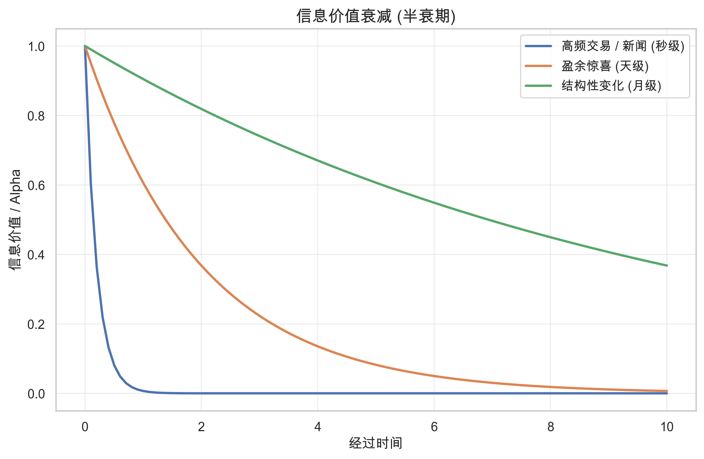

# 第四章：信息与价格

> **核心问题**：信息如何影响价格？谁拥有信息优势？信息如何传播？
> **前置阅读**：[01. 有效市场假说](01_efficient_market_hypothesis.md)

---

## 核心概念定义

### 什么是信息？



在金融市场中，**信息 (Information)** 是能够改变投资者对资产未来现金流或风险预期的任何新数据。

**信息的分类**：

| 类型 | 定义 | 例子 |
|-----|------|------|
| **公开信息** | 所有市场参与者都能获得 | 财报、新闻、宏观数据 |
| **私有信息** | 只有部分人知道 | 内幕消息、独家研究 |
| **硬信息** | 可量化、可验证 | 财务数据、交易记录 |
| **软信息** | 主观判断、难以量化 | 管理层能力、行业趋势判断 |

### 信息与价格的核心问题

金融学关于信息的三个核心问题：

1. **谁知道什么？** — 信息不对称
2. **知情者如何交易？** — 知情交易
3. **信息如何进入价格？** — 价格发现

---

## 一、信息不对称

### 什么是信息不对称？

**信息不对称 (Information Asymmetry)** 是指交易双方拥有的信息不同。

**例子**：
- 公司管理层知道真实经营状况，投资者不知道
- 卖二手车的人知道车况，买家不知道
- 借款人知道自己的还款能力，银行不知道

George Akerlof、Michael Spence、Joseph Stiglitz 因信息不对称研究获得 2001 年诺贝尔经济学奖。

### 1. 柠檬市场 (The Market for Lemons)

**Akerlof (1970) 的经典模型**：

以二手车市场为例：
- 市场上有好车（价值 10 万）和坏车/柠檬（价值 5 万）
- 卖家知道车的质量，买家不知道
- 买家只愿意付平均价格（7.5 万）

```
好车车主：
    我的车值 10 万，但只能卖 7.5 万
    → 不卖了，退出市场

坏车车主：
    我的车值 5 万，能卖 7.5 万
    → 积极出售

结果：
    市场上只剩坏车
    买家知道这一点，只愿付 5 万
    → 市场崩溃
```

**金融市场中的柠檬问题**：

| 场景 | 信息不对称 | 后果 |
|-----|-----------|------|
| IPO 市场 | 公司知道真实价值，投资者不知道 | 低质量公司更愿意上市 |
| 股票增发 | 管理层知道股价是否高估 | 增发往往是负面信号 |
| 债券市场 | 借款人知道违约风险 | 高风险借款人更愿意借钱 |

### 2. 逆向选择 (Adverse Selection)

**定义**：信息不对称导致"坏的"参与者更积极参与市场。

**股票市场的逆向选择**：

```
场景：某投资者频繁大量买入某股票

做市商的担忧：
    如果他是噪音交易者 → 我赚价差
    如果他是知情交易者 → 我亏大了

做市商的应对：
    扩大买卖价差，保护自己
    → 所有交易者的成本都上升
```

**实证**：Glosten & Harris (1988) 发现，买卖价差中约 30-50% 是对逆向选择风险的补偿。

### 3. 道德风险 (Moral Hazard)

**定义**：交易达成后，拥有信息优势的一方改变行为，损害另一方利益。

**金融市场的例子**：

| 场景 | 道德风险 | 后果 |
|-----|---------|------|
| 基金管理 | 基金经理用投资者的钱冒险 | 赚了归自己，亏了归投资者 |
| 公司融资 | 管理层用股东的钱挥霍 | 过度投资、高管薪酬过高 |
| 保险 | 买了保险后行为更冒险 | 赔付增加 |

**委托代理问题**：

道德风险的核心是**委托代理问题 (Principal-Agent Problem)**——委托人（投资者）无法完全监督代理人（管理层）的行为。

### 4. 信号理论 (Signaling)

**定义**：拥有私有信息的一方通过某些行为传递信息。

**Spence (1973) 的教育信号模型**：

- 高能力者和低能力者的劳动生产率不同
- 雇主无法直接观察能力
- 高能力者通过获得学历来传递信号
- 学历本身可能没用，但获取学历的成本对高能力者更低

**金融市场中的信号**：

| 行为 | 传递的信号 | 逻辑 |
|-----|-----------|------|
| **股息支付** | 公司盈利能力强 | 只有真正赚钱的公司才敢承诺持续分红 |
| **股票回购** | 管理层认为股价被低估 | 用真金白银表态 |
| **管理层增持** | 对公司未来有信心 | 自己掏钱买 |
| **高管减持** | 可能是负面信号 | 为什么要卖？ |
| **债务融资** | 公司质量较好 | 差公司借不到钱 |

**例子**：

```
信号：管理层大比例增持
    ↓
解读：
    如果公司前景差，管理层不会自己掏钱买
    增持是"用钱投票"，比口头表态更可信
    ↓
市场反应：股价通常上涨
```

**注意**：信号可能被伪造。如果伪造成本低，信号就不可信。

---

## 二、知情交易

### 谁是知情交易者？

**知情交易者 (Informed Trader)** 是指拥有私有信息、能够预测价格走向的交易者。

**知情交易者的类型**：

| 类型 | 信息来源 | 例子 |
|-----|---------|------|
| **内幕人士** | 公司内部信息 | 高管、大股东、审计师 |
| **分析师** | 专业研究 | 卖方分析师、买方研究员 |
| **机构投资者** | 资源与渠道 | 对冲基金、资管公司 |
| **产业链参与者** | 行业信息 | 供应商、客户、竞争对手 |

### Kyle 模型 (1985)

Kyle 模型是知情交易理论的奠基之作，解释了知情交易者如何策略性地隐藏自己的信息。

**模型设定**：

- **知情交易者**：知道股票真实价值，目标是最大化利润
- **噪音交易者**：随机交易，提供流动性
- **做市商**：根据总订单流设定价格

**核心结论**：

**1. 知情交易者会"慢慢来"**

```
如果知情交易者立即大量买入：
    价格立刻上涨
    → 信息被泄露
    → 利润减少

更优策略：
    分批买入，隐藏在噪音交易者中
    → 价格缓慢调整
    → 赚取更多利润
```

**2. 价格逐渐反映信息**

知情交易者的策略性行为导致信息不是瞬间进入价格，而是逐渐渗透。这解释了为什么市场对信息存在"反应不足"。

**3. 市场深度 (Market Depth)**

Kyle 引入了市场深度的概念——价格对订单流的敏感度。

$$\lambda = \frac{\Delta P}{\Delta Q}$$

其中：
- $\lambda$ = 价格冲击系数（流动性的倒数）
- $\Delta P$ = 价格变化
- $\Delta Q$ = 交易量

$\lambda$ 越大，市场越"浅"，大单交易对价格影响越大。

### Glosten-Milgrom 模型 (1985)

这个模型解释了买卖价差为什么存在。

**模型设定**：

- 做市商面对两类交易者：知情交易者和噪音交易者
- 做市商无法区分两者
- 知情交易者知道股票真实价值

**核心结论**：

**买卖价差是逆向选择成本**

```
交易者要买入：
    如果是噪音交易者 → 做市商赚价差
    如果是知情交易者 → 做市商亏（因为知情者只会在被低估时买）

做市商的应对：
    提高卖价（ask）
    降低买价（bid）
    → 买卖价差扩大
```

**价差的组成**：

| 成分 | 来源 | 占比 |
|-----|------|------|
| 订单处理成本 | 交易执行成本 | 20-30% |
| 存货成本 | 持仓风险 | 20-30% |
| **逆向选择成本** | 对知情交易者的防御 | **40-60%** |

**实证含义**：

- 信息不对称越严重 → 价差越大
- 财报发布前 → 价差扩大（因为可能有信息泄露）
- 小盘股 → 价差更大（信息不对称更严重）

### 知情交易概率 (PIN)

**PIN (Probability of Informed Trading)** 是衡量市场中知情交易活跃程度的指标。

**Easley et al. (1996) 的模型**：

$$PIN = \frac{\alpha \mu}{\alpha \mu + 2\varepsilon}$$

其中：
- $\alpha$ = 信息事件发生的概率
- $\mu$ = 知情交易者的交易强度
- $\varepsilon$ = 噪音交易者的交易强度

**PIN 的含义**：

| PIN 水平 | 含义 | 典型情况 |
|---------|------|---------|
| < 10% | 知情交易少 | 大盘蓝筹股 |
| 10-20% | 中等 | 一般股票 |
| > 20% | 知情交易活跃 | 小盘股、重大事件前 |

**实证发现**：

- 高 PIN 的股票，投资者要求更高的回报（作为信息风险补偿）
- 财报发布前 PIN 上升，说明有信息提前泄露
- PIN 可以预测未来收益——高 PIN 股票后续表现更差

---

## 三、信息传播与价格发现

### 价格发现的机制

**价格发现 (Price Discovery)** 是指信息逐渐被反映到价格中的过程。

**信息进入价格的路径**：

```
私有信息产生
    ↓
知情交易者交易
    ↓
订单流变化
    ↓
做市商调整报价
    ↓
价格变化
    ↓
其他投资者观察价格，推断信息
    ↓
信息变为公开
```

### 信息传播的速度

不同类型信息的传播速度差异很大：

| 信息类型 | 传播速度 | 例子 |
|---------|---------|------|
| **硬信息** | 极快（秒级） | 财报发布、宏观数据 |
| **软信息** | 较慢（天/周级） | 分析师调研、行业趋势 |
| **复杂信息** | 很慢（周/月级） | 需要专业分析才能理解的信息 |

**实证**：

- Bernard & Thomas (1989)：盈利公告后的漂移持续 60 个交易日
- Huberman & Regev (2001)：同样的新闻，第一次没人注意，第二次引发股价暴涨

**"有限注意力"假说**：

投资者的注意力是有限的。复杂的、不显眼的信息可能被忽视，导致价格反应延迟。

**例子**：

```
场景：公司在 500 页年报的第 387 页披露了一项重要风险

投资者反应：
    大多数人不会看完全文
    → 信息被忽视
    → 价格没有反映

直到：
    分析师写报告提到这个风险
    → 投资者开始关注
    → 价格下跌
```

### 信息溢出效应

一家公司的信息可能影响其他公司的股价。

**类型**：

| 溢出类型 | 机制 | 例子 |
|---------|------|------|
| **行业溢出** | 同行业公司受类似因素影响 | 一家芯片公司业绩好 → 整个芯片板块上涨 |
| **供应链溢出** | 上下游关联 | 苹果销量好 → 供应商股价上涨 |
| **竞争溢出** | 零和博弈 | A 公司获得大单 → 竞争对手股价下跌 |
| **宏观溢出** | 反映整体经济 | 一家公司业绩差 → 可能预示经济下滑 |

**实证**：Foster (1981) 发现，同行业公司的盈利公告会影响其他公司的股价。

---

## 四、Grossman-Stiglitz 悖论

### 悖论的内容

**Grossman & Stiglitz (1980)** 提出了一个著名悖论：

> **如果市场完全有效，就没有人有动力去收集信息；**
> **如果没有人收集信息，价格就不可能有效。**

**逻辑链条**：

```
假设市场完全有效
    ↓
价格已经反映所有信息
    ↓
研究信息没有收益
    ↓
没有人愿意花成本研究
    ↓
没有信息被收集和处理
    ↓
价格无法反映信息
    ↓
市场不可能完全有效
    ↓
矛盾！
```

### 悖论的解决

Grossman-Stiglitz 的解决方案：**市场必须是"部分有效"的**。

**均衡状态**：

```
知情交易者的收益 = 信息收集成本

如果收益 > 成本 → 更多人收集信息 → 价格更有效 → 收益下降
如果收益 < 成本 → 更少人收集信息 → 价格更无效 → 收益上升
```

**均衡含义**：

| 结论 | 含义 |
|-----|------|
| 市场不可能完全有效 | 否则没有人有动力研究 |
| 信息收集有回报 | 但回报刚好覆盖成本 |
| 价格包含噪音 | 这是激励信息收集的必要条件 |

**对量化交易的启示**：

> Alpha 存在是必然的——否则市场无法运转。
> 但 Alpha 的规模受限——它必须刚好足以激励信息收集活动。

---

## 五、实证证据

### 内幕交易研究

**内幕交易是否存在？**

| 证据 | 研究 | 发现 |
|-----|------|------|
| 并购前的异常交易 | Meulbroek (1992) | 并购公告前股价和交易量异常上升 |
| 财报前的异常交易 | Christophe et al. (2004) | 盈利公告前做空活动增加 |
| 高管交易的预测力 | Seyhun (1986) | 高管买入后股价上涨，卖出后下跌 |

**内幕交易的规模**：

- 约 40-50% 的并购在公告前存在异常交易
- 财报公告前的异常交易通常在公告前 5-10 天开始

### 分析师的信息价值

**分析师有信息优势吗？**

| 研究 | 发现 |
|-----|------|
| Womack (1996) | 分析师推荐后股价持续数月调整 |
| Loh & Stulz (2011) | 明星分析师的推荐更有预测力 |
| Clement (1999) | 经验丰富的分析师预测更准确 |

**分析师信息优势的来源**：

```
1. 专业知识：更能理解复杂信息
2. 渠道优势：与管理层直接沟通（虽然有 Reg FD 限制）
3. 时间投入：全职研究特定行业
4. 网络效应：同行交流获取信息
```

**局限**：

- 存在利益冲突（投行业务、维护关系）
- 羊群效应（跟随其他分析师）
- 过度乐观偏差

### 机构投资者的信息优势

**机构投资者比散户更"聪明"吗？**

| 证据 | 研究 | 发现 |
|-----|------|------|
| 机构持股变化 | Yan & Zhang (2009) | 短期机构投资者的交易有预测力 |
| 13F 持仓变化 | Bushee & Goodman (2007) | 机构增持的股票后续表现更好 |
| 机构订单流 | Campbell et al. (2009) | 机构买入预示正收益 |

**机构信息优势的来源**：

| 来源 | 说明 |
|-----|------|
| **资源优势** | 更多研究人员、更好的数据 |
| **渠道优势** | 参加公司路演、与管理层会面 |
| **专业优势** | 更强的分析能力 |
| **规模优势** | 能承担高质量研究的固定成本 |

---

## 六、学术争议

### 信息效率的边界在哪里？

**争议焦点**：市场对信息的反应是否足够快、足够准确？

| 观点 | 支持证据 | 反对证据 |
|-----|---------|---------|
| 市场反应很快 | 重大新闻秒级反应 | 盈余公告后漂移持续数月 |
| 市场反应准确 | 长期来看价格趋向基本面 | 短期存在过度/不足反应 |

### 信息不对称是好是坏？

**两种观点**：

**"信息不对称有害"**：
- 增加交易成本（更大的买卖价差）
- 降低市场流动性
- 导致逆向选择，劣币驱逐良币

**"信息不对称有益"**：
- 激励信息收集和研究
- 促进价格发现
- 如果没有信息优势，谁会花成本研究？

**均衡观点**：适度的信息不对称是市场运转的必要条件。

---

## 七、对量化交易的启示

### 1. 信息优势的来源

**你的信息优势可能来自**：

| 来源 | 例子 | 可持续性 |
|-----|------|---------|
| **数据优势** | 独特的另类数据源 | 中（可能被复制） |
| **处理优势** | 更快、更好的分析方法 | 中 |
| **解读优势** | 更深刻的理解 | 高（难以复制） |
| **速度优势** | 更快的反应 | 低（军备竞赛） |

### 2. 信息时效性

**信息的价值随时间衰减**：

```
T = 0：信息产生（价值最高）
    ↓
T = 1：知情交易者开始交易
    ↓
T = 2：价格开始调整
    ↓
T = 3：其他人观察到价格变化
    ↓
T = 4：信息变为公开（价值为零）
```

**启示**：
- 执行速度很重要
- 但不必追求极致速度——理解深度可能更有价值
- 关注"慢信息"——复杂信息的价格调整更慢

### 3. 利用信息不对称

**策略方向**：

| 信息特征 | 策略 |
|---------|------|
| 复杂信息反应慢 | 深入研究复杂信息，赚取延迟反应的收益 |
| 小公司覆盖少 | 关注分析师覆盖少的公司 |
| 软信息难量化 | 开发量化软信息的方法 |
| 信号可能可信 | 跟踪管理层增持、回购等信号 |

### 4. 警惕逆向选择

**当你是买方时**：

> 愿意卖给你的人，可能知道你不知道的事。

**当你是卖方时**：

> 愿意买你的人，可能知道你不知道的事。

**应对**：
- 了解交易对手是谁
- 思考"为什么他愿意和我交易"
- 避免在信息劣势时大量交易

---

## 小结

**本章的逻辑链条**：

```
信息不对称存在
    ↓
知情交易者利用信息优势交易
    ↓
价格逐渐反映信息
    ↓
但反映不完全（Grossman-Stiglitz 悖论）
    ↓
Alpha 机会存在于信息优势中
```

**核心要点**：

1. **信息不对称**：柠檬市场、逆向选择、道德风险、信号理论
2. **知情交易**：Kyle 模型（策略性交易）、Glosten-Milgrom 模型（买卖价差）
3. **价格发现**：信息逐渐进入价格，传播速度因信息类型而异
4. **Grossman-Stiglitz 悖论**：市场必须是"部分有效"的

**对量化交易的意义**：

> 信息优势是 Alpha 的重要来源。
>
> 但信息优势来自于比别人更快、更好地理解信息——而不是简单地拥有信息。

---

## 延伸阅读

### 后续篇章

- [05. 因子定价：什么是系统性收益来源？](05_factor_pricing.md) — 从信息到因子

### 参考文献

**核心论文**：

1. Akerlof, G. A. (1970). "The Market for 'Lemons': Quality Uncertainty and the Market Mechanism." *Quarterly Journal of Economics*.
2. Kyle, A. S. (1985). "Continuous Auctions and Insider Trading." *Econometrica*.
3. Glosten, L. R., & Milgrom, P. R. (1985). "Bid, Ask and Transaction Prices in a Specialist Market with Heterogeneously Informed Traders." *Journal of Financial Economics*.
4. Grossman, S. J., & Stiglitz, J. E. (1980). "On the Impossibility of Informationally Efficient Markets." *American Economic Review*.
5. Easley, D., Kiefer, N. M., O'Hara, M., & Paperman, J. B. (1996). "Liquidity, Information, and Infrequently Traded Stocks." *Journal of Finance*.

**推荐书籍**：

1. O'Hara, M. (1995). *Market Microstructure Theory*. — 市场微观结构的经典教材
2. Harris, L. (2003). *Trading and Exchanges*. — 面向从业者的市场结构指南
3. Hasbrouck, J. (2007). *Empirical Market Microstructure*. — 实证方法综述
