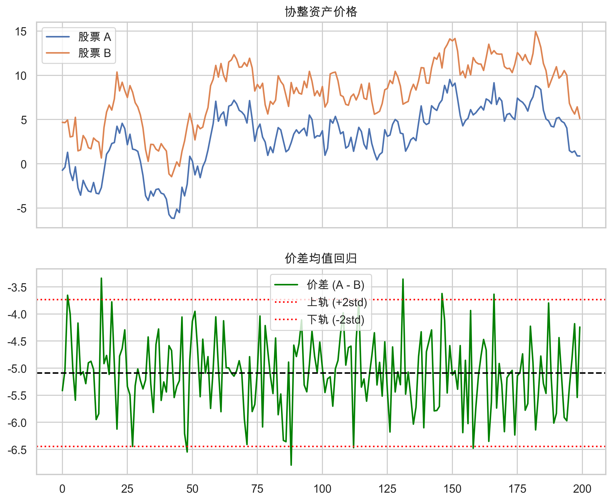

# 第七章：套利策略

> **核心问题**：套利的理论基础是什么？为什么套利机会存在且持续？
> **前置阅读**：[03. 限制套利](03_limits_to_arbitrage.md)、[04. 信息与价格](04_information_and_price.md)

---

## 核心概念定义

### 什么是套利？

**套利 (Arbitrage)** 是指利用价格差异获取利润的行为。

**严格定义（学术）**：

> 在不承担任何风险、不投入任何资本的情况下，获取确定的正收益。

这种"纯套利"在理论上不应该存在——如果存在，会被瞬间消除。

**实践定义（交易）**：

> 利用相关资产之间的价格偏离，在风险可控的情况下获取收益。

实践中的套利通常有风险，只是风险被认为较低或可对冲。

### 套利的分类

| 类型 | 风险程度 | 收益来源 | 例子 |
|-----|---------|---------|------|
| **纯套利** | 零风险 | 价格错误 | 同一股票在两个市场价格不同 |
| **统计套利** | 低-中风险 | 统计规律 | 配对交易 |
| **结构套利** | 中风险 | 市场机制 | ETF 套利、期现套利 |
| **事件套利** | 中-高风险 | 事件结果 | 并购套利（见第8章） |

### 一价定律

**一价定律 (Law of One Price)** 是套利的理论基础：

> 相同的资产在不同市场应该有相同的价格。

如果违反一价定律（价格不同），套利者会：
1. 在便宜的市场买入
2. 在贵的市场卖出
3. 赚取差价
4. 推动价格回归一致

---

## 一、统计套利

### 1. 什么是统计套利？



**统计套利 (Statistical Arbitrage, StatArb)** 是一类利用资产价格之间的统计规律进行交易的策略。

**核心思想**：

```
两个相关资产 A 和 B
    ↓
历史上价格比例稳定在某个水平
    ↓
当前比例偏离历史水平
    ↓
做多被低估的，做空被高估的
    ↓
等待价格比例回归
    ↓
平仓获利
```

**与纯套利的区别**：

| 维度 | 纯套利 | 统计套利 |
|-----|-------|---------|
| 收益确定性 | 确定 | 概率性（统计上有优势） |
| 风险 | 零 | 存在（价格可能不回归） |
| 时间 | 瞬时 | 需要持有一段时间 |
| 资本需求 | 理论上不需要 | 需要资本和保证金 |

### 2. 配对交易

**配对交易 (Pairs Trading)** 是最经典的统计套利策略。

**基本原理**：

找两只高度相关的股票（如同行业龙头），当它们的价格比例偏离历史均值时：
- 做多相对便宜的
- 做空相对贵的
- 等待价格比例回归

**例子**：

```
可口可乐（KO）和百事可乐（PEP）

历史价格比例：KO/PEP ≈ 1.2
当前价格比例：KO/PEP = 1.0（KO相对便宜）

操作：
    做多 KO
    做空 PEP
    等待比例回归到 1.2

风险：
    比例可能不回归
    可能因基本面变化而进一步偏离
```

**配对选择标准**：

| 标准 | 说明 |
|-----|------|
| 高相关性 | 历史价格相关系数 > 0.8 |
| 同行业 | 受相同因素驱动 |
| 相似市值 | 避免大小盘差异 |
| 协整性 | 价差是平稳过程 |

### 3. 协整与平稳性

**协整 (Cointegration)** 是统计套利的核心概念。

**直观理解**：

```
两只股票各自可能是随机游走（不可预测）
但它们的某种线性组合可能是平稳的（均值回归）

例如：
    股票 A 的价格：不可预测
    股票 B 的价格：不可预测
    A - 1.5×B：围绕某个均值波动，可预测

这时我们说 A 和 B 是协整的
```

**为什么协整比相关性更重要？**

| 概念 | 含义 | 对套利的意义 |
|-----|------|-------------|
| 相关性 | 价格变动方向相似 | 高相关不保证价差会回归 |
| 协整性 | 价差是平稳过程 | 价差会回归均值 |

**检验方法**：

1. **Engle-Granger 两步法**：
   - 回归：A = β × B + ε
   - 检验残差 ε 是否平稳（ADF 检验）

2. **Johansen 检验**：
   - 检验多个变量之间的协整关系
   - 可以处理多于两个变量的情况

### 4. 统计套利的策略构建

**步骤 1：配对选择**

```
从股票池中：
1. 计算所有配对的相关系数
2. 筛选高相关配对（> 0.8）
3. 检验协整性
4. 选择协整配对
```

**步骤 2：计算价差**

```
价差 = A - β × B

其中 β 是协整回归的系数
```

**步骤 3：信号生成**

```
计算价差的 z-score：
z = (当前价差 - 均值) / 标准差

信号规则：
    z > 2：价差过大 → 做空 A，做多 B
    z < -2：价差过小 → 做多 A，做空 B
    |z| < 0.5：价差回归 → 平仓
```

**步骤 4：风险控制**

| 风险 | 控制方法 |
|-----|---------|
| 价差不回归 | 止损（如 z > 4 时止损） |
| 单边风险 | 保持市场中性（等金额多空） |
| 流动性 | 选择流动性好的股票 |
| 参数不稳定 | 定期重新估计参数 |

### 5. 统计套利的风险

**（1）模型风险**

协整关系可能：
- 本身就不存在（过拟合）
- 随时间变化（结构性断裂）
- 在极端市场失效

**（2）收敛风险**

价差可能在平仓前继续扩大：

```
z = 2 时开仓
    ↓
价差继续扩大
    ↓
z = 4（账面亏损）
    ↓
被迫止损或追加保证金
    ↓
之后价差回归（但你已经出局）
```

**（3）流动性风险**

- 做空可能借不到券
- 极端市场流动性枯竭
- 平仓成本上升

**（4）拥挤风险**

大量资金使用相同策略：
- 同时开仓 → 信号减弱
- 同时平仓 → 价差波动加大

---

## 二、ETF 套利

### 1. ETF 的定价机制

**ETF (Exchange-Traded Fund)** 是可以在交易所买卖的基金。

**两种价格**：

| 价格 | 定义 | 交易方式 |
|-----|------|---------|
| 市场价格 | 交易所的买卖价 | 二级市场买卖 |
| 净值（NAV） | 成分股价值之和 | 一级市场申赎 |

**理论上**：市场价格 = 净值

**实际上**：两者会有偏差（溢价或折价）

### 2. ETF 套利的原理

当 ETF 市场价格偏离净值时，可以套利：

**溢价套利（市场价 > 净值）**：

```
1. 买入成分股组合
2. 在一级市场申购 ETF
3. 在二级市场卖出 ETF
4. 获取溢价收益
```

**折价套利（市场价 < 净值）**：

```
1. 在二级市场买入 ETF
2. 在一级市场赎回，获得成分股
3. 卖出成分股
4. 获取折价收益
```

### 3. ETF 套利的类型

**（1）瞬时套利**

最基本的套利，利用 ETF 价格与净值的偏离。

**要求**：
- 高速交易系统
- 低交易成本
- 足够的资金规模

**（2）延时套利（T+0 套利）**

利用 ETF 可以 T+0 交易的特性：

```
当日买入成分股
    ↓
申购 ETF
    ↓
当日卖出 ETF
    ↓
实现 T+0 交易（变相）
```

**（3）事件套利**

利用成分股停牌等特殊事件：

```
成分股 A 停牌
    ↓
复牌后可能大涨（好消息）或大跌（坏消息）
    ↓
通过 ETF 交易获取 A 的涨跌
```

**（4）跨市场 ETF 套利**

同一指数在不同市场的 ETF 之间套利：

```
上证 50 ETF（上海）
华夏上证 50 ETF（深圳）

如果两者价格不同，可以套利
```

### 4. ETF 套利的限制

| 限制因素 | 影响 |
|---------|------|
| 申赎门槛 | 通常需要 100 万份以上 |
| 交易成本 | 手续费、印花税、冲击成本 |
| 时间延迟 | 申赎需要时间，价格可能变化 |
| 停牌成分股 | 无法完全复制指数 |
| 套利资金规模 | 大量套利压缩利润空间 |

### 5. LOF 和分级基金套利

**LOF（上市开放式基金）套利**：

与 ETF 套利类似，但：
- 申赎是现金而非成分股
- T+2 结算，套利周期长
- 风险更大

**分级基金套利**（历史）：

分级基金 A + B = 母基金

当 A + B 的市场价格 ≠ 母基金净值时可套利。

> 注：中国分级基金已于 2020 年前后逐步清退。

---

## 三、期现套利

### 1. 什么是期现套利？

**期现套利 (Cash-and-Carry Arbitrage)** 是利用期货与现货价格偏离进行的套利。

**理论基础**：期货价格应等于现货价格加上持有成本。

```
期货理论价格 = 现货价格 × (1 + r - d) ^ T

其中：
    r = 无风险利率
    d = 股息率（股指期货）或存储成本（商品）
    T = 到期时间
```

### 2. 基差与套利方向

**基差 (Basis)** = 期货价格 - 现货价格

| 基差状态 | 含义 | 套利方向 |
|---------|------|---------|
| 正基差（升水） | 期货 > 现货 | 卖期货，买现货 |
| 负基差（贴水） | 期货 < 现货 | 买期货，卖现货 |

**正向套利（基差过大）**：

```
期货价格 = 4200
现货价格 = 4000
理论基差 = 50
实际基差 = 200（过大）

操作：
    卖出期货
    买入现货（或 ETF）
    持有至到期
    期货现货价格收敛
    获取 150 点利润
```

**反向套利（基差过小或为负）**：

```
期货价格 = 3950
现货价格 = 4000
理论基差 = 50
实际基差 = -50（负基差）

操作：
    买入期货
    卖出现货（融券或持有现货）
    持有至到期
    获取利润

难点：
    融券成本高
    融券可能借不到
```

### 3. 股指期货套利

**套利机会来源**：

| 来源 | 说明 |
|-----|------|
| 市场情绪 | 恐慌时期货大幅贴水 |
| 资金成本差异 | 不同投资者融资成本不同 |
| 流动性差异 | 期货流动性可能更好 |
| 分红预期 | 分红预期变化影响理论基差 |

**2015 年股灾期间的案例**：

```
2015 年 7 月，股市大跌
IF 期货一度贴水超过 10%（年化）

原因：
    大量投资者用期货做空对冲
    期货卖压巨大
    贴水持续数月

套利机会：
    买入期货
    卖出现货（或持有现货不动）
    获取巨额贴水收益

但风险：
    极端行情下贴水可能继续扩大
    保证金追加压力
    现货难以做空
```

### 4. 商品期现套利

商品期现套利的特殊考虑：

| 因素 | 影响 |
|-----|------|
| 存储成本 | 持有现货需要仓储费 |
| 交割品质 | 期货交割品与现货可能不同 |
| 交割地点 | 运输成本 |
| 增值税 | 交割涉及税务问题 |
| 资金占用 | 商品套利资金占用大 |

**适合套利的商品**：
- 标准化程度高（如贵金属）
- 存储成本低
- 交割便利

---

## 四、跨品种套利

### 1. 什么是跨品种套利？

**跨品种套利** 是利用相关品种之间的价格关系进行套利。

**与统计套利的区别**：

| 维度 | 统计套利 | 跨品种套利 |
|-----|---------|-----------|
| 关系基础 | 统计相关性 | 经济/产业链关系 |
| 品种选择 | 同类资产 | 相关但不同的资产 |
| 理论支撑 | 历史规律 | 经济逻辑 |

### 2. 常见的跨品种套利

**（1）产业链套利**

```
大豆 → 豆粕 + 豆油

压榨利润 = 豆粕价格 × 0.8 + 豆油价格 × 0.18 - 大豆价格

当压榨利润过高：
    买大豆，卖豆粕和豆油

当压榨利润过低：
    卖大豆，买豆粕和豆油
```

**（2）替代品套利**

```
玉米 和 小麦 都可以做饲料

当玉米相对小麦过贵：
    卖玉米，买小麦
    饲料厂会用小麦替代玉米
    价差回归
```

**（3）跨期套利**

同一品种不同到期月份之间的套利：

```
原油 近月合约 vs 远月合约

正常情况：远月 > 近月（持有成本）

当远月溢价过大：
    卖远月，买近月
    等待价差收敛
```

**（4）跨市场套利**

同一品种在不同交易所之间的套利：

```
伦敦铜 vs 上海铜

考虑：
    汇率
    运输成本
    关税
    质量差异
```

### 3. 跨品种套利的风险

| 风险 | 说明 |
|-----|------|
| 基本面变化 | 产业链关系可能改变 |
| 季节性 | 某些价差有季节规律 |
| 政策风险 | 关税、补贴政策变化 |
| 流动性差异 | 不同品种流动性不同 |
| 保证金变化 | 极端行情保证金要求提高 |

---

## 五、可转债套利

### 1. 可转债的特性

**可转债 (Convertible Bond)** 是可以转换为股票的债券。

**价值构成**：

```
可转债价值 = 债券价值 + 转换期权价值

债券价值：到期还本付息的现值
转换期权价值：转换为股票的权利价值
```

**关键指标**：

| 指标 | 定义 | 含义 |
|-----|------|------|
| 转股价 | 每张转债可转换的股价 | 转股价越低越好 |
| 转股价值 | 正股价格 / 转股价 × 100 | 如果转股能得到多少 |
| 转股溢价率 | (转债价格 - 转股价值) / 转股价值 | 溢价率越低越好 |
| 纯债价值 | 作为债券的价值 | 下跌保护 |

### 2. 可转债套利策略

**（1）折价转股套利**

当转债价格 < 转股价值时：

```
转债价格 = 98
转股价值 = 105

操作：
    买入转债
    转股
    卖出股票
    获利 7%

限制：
    转股需要时间（T+1）
    股价可能下跌
    流动性
```

**（2）正股涨停套利**

当正股涨停买不到时：

```
正股涨停，无法买入
但转债可以继续交易

操作：
    买入转债
    如果明天正股继续涨
    转债也会涨
    或者转股获得正股

风险：
    正股明天可能跌
    转股溢价率变化
```

**（3）Delta 对冲套利**

将可转债视为期权，进行 Delta 对冲：

```
持有可转债
    ↓
计算 Delta（对正股价格的敏感度）
    ↓
做空相应数量的正股
    ↓
构建市场中性组合
    ↓
赚取波动率收益和时间价值
```

### 3. 可转债套利的风险

| 风险 | 说明 |
|-----|------|
| 正股波动 | 转债价格受正股影响 |
| 信用风险 | 发行人违约风险 |
| 流动性风险 | 部分转债流动性差 |
| 条款风险 | 强赎、下修等条款 |
| 转股失败 | 转股期限制 |

---

## 六、套利的限制与风险

### 1. 为什么套利机会存在？

理论上套利应该瞬间消除，但实际上套利机会持续存在：

| 原因 | 说明 |
|-----|------|
| 交易成本 | 手续费、价差、冲击成本 |
| 资金限制 | 套利需要资金，资金有成本 |
| 风险 | 套利并非无风险 |
| 执行难度 | 需要同时交易多个市场 |
| 信息不对称 | 不是所有人都能发现机会 |
| 制度限制 | 做空限制、交割规则等 |

### 2. 限制套利理论的应用

[第三章](03_limits_to_arbitrage.md) 详细讨论了限制套利理论。

**核心观点**：套利不是免费的午餐，存在：

- **基本面风险**：价格可能因基本面变化而不回归
- **噪声交易者风险**：短期内价格可能进一步偏离
- **执行风险**：无法完美执行套利交易
- **模型风险**：价格关系可能改变

### 3. 套利策略的系统性风险

**2007-2008 年量化危机**：

```
2007 年 8 月，大量量化基金同时亏损

原因：
    很多基金使用相似的统计套利策略
    某些基金被迫平仓
    卖出压力导致价格进一步偏离
    触发更多基金平仓
    恶性循环

教训：
    套利策略有"拥挤风险"
    极端情况下相关性急剧上升
    需要关注全市场的策略分布
```

### 4. 套利收益的来源

思考套利收益从哪里来：

| 来源 | 说明 | 可持续性 |
|-----|------|---------|
| 市场无效 | 错误定价 | 随竞争减少 |
| 流动性提供 | 承担流动性风险 | 可持续 |
| 信息优势 | 更快获取/处理信息 | 需要持续投入 |
| 承担风险 | 风险溢价 | 可持续但需承担风险 |
| 结构性机会 | 制度造成的机会 | 制度改变后消失 |

---

## 对量化交易的启示

### 1. 策略选择

| 套利类型 | 适合的投资者 | 核心要求 |
|---------|-------------|---------|
| ETF 套利 | 专业机构 | 高速系统、大资金 |
| 期现套利 | 期货投资者 | 现货持仓能力 |
| 统计套利 | 量化基金 | 研究能力、风控 |
| 可转债套利 | 灵活资金 | 对条款的理解 |

### 2. 风险管理

| 风险 | 管理方法 |
|-----|---------|
| 收敛风险 | 止损、仓位控制 |
| 流动性风险 | 选择流动性好的品种 |
| 模型风险 | 定期验证、多模型 |
| 拥挤风险 | 监控市场拥挤度 |
| 极端事件 | 压力测试、尾部对冲 |

### 3. 核心认知

> **套利的本质是提供市场效率。**
>
> 套利者通过纠正价格偏离，使市场更有效。作为回报，套利者获得利润。

> **但套利不是无风险的。**
>
> 实践中的套利都有风险。理解风险来源，管理风险敞口，是套利成功的关键。

> **套利收益会被竞争侵蚀。**
>
> 越多人做同样的套利，利润空间越小。需要不断寻找新的机会，或者在执行上建立优势。

---

## 加密货币市场的特殊考量

加密货币市场为套利者提供了独特的机会和挑战。

### 跨交易所套利

加密市场的碎片化创造了持续的跨所套利机会：

| 维度 | 传统市场 | 加密市场 |
|------|---------|---------|
| 交易所数量 | 少数几个 | 数百家 |
| 价差幅度 | < 0.01% | 0.1% - 5% |
| 套利窗口 | 毫秒级 | 秒到分钟级 |
| 资金转移 | 即时 | 10分钟到1小时 |

**传统方式的困境**：

```
发现价差：Binance BTC = 60,000，Kraken BTC = 60,500
    ↓
在 Binance 买入
    ↓
转账到 Kraken（需要 30 分钟）
    ↓
价差可能已消失
```

**现代方式**：在多个交易所预置资金，同时执行买卖。

**资金效率问题**：如果在 5 个交易所各放 $100,000，单次套利赚 $500，资金利用率仅 0.1%。

### 三角套利

利用三个交易对之间的定价不一致：

```
BTC/USDT = 60,000
ETH/USDT = 3,000
ETH/BTC = 0.051（隐含应为 0.050）

套利路径：
USDT → ETH → BTC → USDT
可获取约 2% 利润
```

### 资金费率套利

**永续合约**是加密市场的独特发明，通过"资金费率"锚定现货价格。

```
策略：现货多头 + 永续空头

收益来源：
- 价格波动：对冲（盈亏相抵）
- 资金费率：正费率时持续收取

年化收益：牛市时可达 20-40%

风险：
- 资金费率可能转负
- 极端行情下永续与现货价格脱钩
- 强平风险
```

### 独有风险

| 风险 | 说明 |
|-----|------|
| 交易所风险 | 交易所可能被黑、跑路、冻结资金 |
| 提币延迟 | 区块链拥堵导致转账延迟 |
| 流动性碎片化 | 深度不足导致滑点 |
| 监管不确定性 | 政策变化可能影响套利可行性 |

> **启示**：加密市场的套利机会更多、利润更厚，但风险也更高。交易所风险是传统套利者从未面对的新维度。
>
> 详见 [第十二章：加密货币市场](12_cryptocurrency_markets.md)

---

## 小结

**本章逻辑链条**：

```
一价定律（理论基础）
    ↓
套利消除价格偏离（机制）
    ↓
各类套利策略（实践）
    ↓
套利的限制与风险（现实约束）
    ↓
套利收益的来源与可持续性（本质）
```

**核心要点**：

1. **套利定义**：利用价格差异获利，理论上无风险，实践中有风险
2. **统计套利**：利用统计规律，核心是协整关系
3. **ETF 套利**：利用 ETF 价格与净值的偏离
4. **期现套利**：利用期货与现货的基差
5. **跨品种套利**：利用相关品种的价格关系
6. **可转债套利**：利用转债的多重属性
7. **套利限制**：交易成本、资金限制、风险、执行难度

**与其他章节的联系**：

- [03. 限制套利](03_limits_to_arbitrage.md)：为什么套利机会可以持续存在
- [04. 信息与价格](04_information_and_price.md)：价格发现与套利的关系
- [08. 事件驱动策略](08_event_driven.md)：事件套利（如并购套利）

---

## 延伸阅读

### 后续篇章

- [08. 事件驱动策略](08_event_driven.md) — 并购套利等事件相关策略
- [14. 市场微观结构](14_market_microstructure.md) — 套利与市场流动性

### 参考文献

**核心论文**：

1. Gatev, E., Goetzmann, W. N., & Rouwenhorst, K. G. (2006). "Pairs Trading: Performance of a Relative-Value Arbitrage Rule." *Review of Financial Studies*.
2. Shleifer, A., & Vishny, R. W. (1997). "The Limits of Arbitrage." *Journal of Finance*.
3. Mitchell, M., Pulvino, T., & Stafford, E. (2002). "Limited Arbitrage in Equity Markets." *Journal of Finance*.
4. Engle, R. F., & Granger, C. W. J. (1987). "Co-Integration and Error Correction." *Econometrica*.

**推荐书籍**：

1. Vidyamurthy, G. (2004). *Pairs Trading: Quantitative Methods and Analysis*. — 配对交易的详细指南
2. Pole, A. (2007). *Statistical Arbitrage*. — 统计套利的系统介绍
3. Chan, E. P. (2013). *Algorithmic Trading*. — 包含套利策略的算法交易指南
