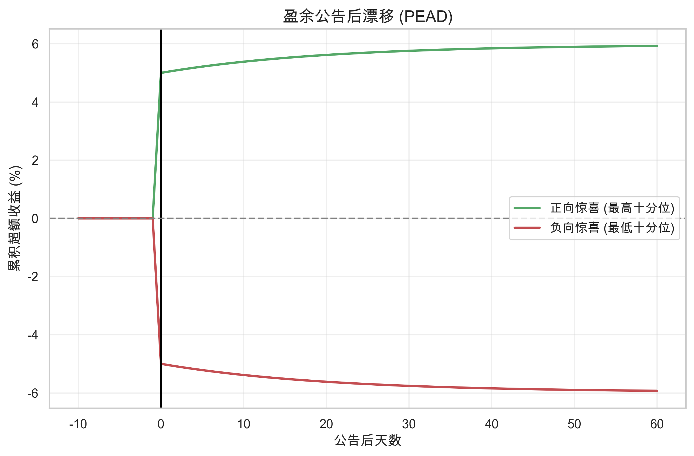

# 第八章：事件驱动策略

> **核心问题**：为什么特定事件能带来超额收益？市场对事件的反应为什么不是有效的？
> **前置阅读**：[02. 行为金融](02_behavioral_finance.md)、[04. 信息与价格](04_information_and_price.md)

---

## 核心概念定义

### 什么是事件驱动策略？



**事件驱动 (Event Driven)** 策略是指利用特定公司事件（如并购、财报、破产、回购等）带来的价格波动进行获利的策略。

**核心逻辑**：

```
特定事件发生（或即将发生）
        ↓
事件对资产价值有可预测的影响
        ↓
市场对事件的反应不完全有效
        ↓
在事件前/后建立头寸
        ↓
获取超额收益
```

### 事件的分类

| 类型 | 例子 | 特点 |
|-----|------|------|
| **公司事件** | 并购、分拆、破产、管理层变动 | 影响单个公司 |
| **财务事件** | 财报发布、股息公告、评级变动 | 定期或可预期 |
| **资本结构事件** | 增发、回购、可转债转股 | 影响股本结构 |
| **指数事件** | 指数调整、成分股变动 | 影响被动资金流 |
| **监管事件** | 政策发布、法规变化 | 影响行业或市场 |

### 事件研究方法

**事件研究 (Event Study)** 是分析事件对资产价格影响的标准方法。

**基本步骤**：

```
1. 定义事件和事件窗口
2. 估计正常收益（无事件时的预期收益）
3. 计算异常收益 = 实际收益 - 正常收益
4. 统计检验异常收益是否显著
```

**异常收益 (Abnormal Return)**：

$$AR_t = R_t - E[R_t]$$

**累计异常收益 (CAR)**：

$$CAR = \sum_{t=t_1}^{t_2} AR_t$$

---

## 一、并购套利

### 1. 什么是并购套利？

**并购套利 (Merger Arbitrage)** 是在并购公告后，利用目标公司股价与收购价之间的价差获利。

**基本原理**：

```
并购公告：
    收购方 A 宣布以 50 元/股收购目标公司 B
    B 的股价从 35 元跳涨到 47 元

价差存在：
    收购价 = 50 元
    当前股价 = 47 元
    价差 = 3 元（6%）

套利操作：
    买入 B 的股票 @ 47 元
    等待交易完成
    以 50 元卖出（或被收购）
    获利 3 元
```

### 2. 为什么存在价差？

并购宣布后，目标公司股价通常低于收购价，原因：

| 原因 | 说明 |
|-----|------|
| **交易风险** | 交易可能失败（监管否决、融资失败等） |
| **时间成本** | 交易完成需要时间，资金有机会成本 |
| **条款不确定** | 最终价格可能调整 |
| **流动性** | 部分投资者不愿等待，选择卖出 |

### 3. 并购套利的收益与风险

**收益来源**：

| 来源 | 典型收益 |
|-----|---------|
| 价差收敛 | 3-10%（取决于交易风险） |
| 时间价值 | 年化 5-15% |
| 特殊情况 | 竞价收购时收益更高 |

**风险因素**：

| 风险 | 后果 |
|-----|------|
| 交易失败 | 股价可能跌回公告前水平，损失 20-40% |
| 条款变更 | 价格下调或交易结构改变 |
| 时间延长 | 降低年化收益 |
| 融资失败 | 交易取消 |
| 监管否决 | 反垄断审查不通过 |

**不对称性**：

```
成功情况：赚 3-10%
失败情况：亏 20-40%

因此需要高成功率才能盈利
历史上并购交易成功率约 85-90%
```

### 4. 并购套利的策略构建

**（1）交易筛选**

评估交易完成概率的关键因素：

| 因素 | 高完成概率 | 低完成概率 |
|-----|-----------|-----------|
| 融资安排 | 已落实融资 | 融资待定 |
| 监管风险 | 无反垄断问题 | 市场集中度高 |
| 股东态度 | 友好收购 | 敌意收购 |
| 交易结构 | 现金收购 | 换股收购 |
| 收购方财务 | 财务稳健 | 杠杆过高 |

**（2）头寸构建**

**纯多头**：
- 只买入目标公司
- 风险：交易失败损失大

**多空对冲（换股收购）**：
```
换股收购条款：1 股 B = 0.5 股 A

操作：
    买入 1 股 B
    卖空 0.5 股 A

效果：
    对冲收购方股价波动
    只承担交易完成风险
```

**（3）仓位管理**

```
单笔交易仓位 = f(完成概率, 价差, 时间)

高确定性交易：较大仓位
低确定性交易：较小仓位

总仓位分散在多笔交易中
```

### 5. 实证证据

**Mitchell & Pulvino (2001)** 研究 1963-1998 年的并购套利：

| 指标 | 数值 |
|-----|------|
| 年化收益 | 约 4%（超额） |
| 波动率 | 约 4% |
| 夏普比率 | 约 1.0 |
| 与市场相关性 | 低（约 0.1） |

**特点**：
- 收益类似卖出看跌期权
- 正常时期稳定盈利
- 市场危机时可能大幅亏损（交易失败率上升）

---

## 二、盈余公告交易

### 1. 盈余公告后漂移（PEAD）

**盈余公告后漂移 (Post-Earnings Announcement Drift, PEAD)** 是最著名的市场异象之一。

**现象**：

```
好消息（盈余超预期）公布后：
    股价当天上涨
    但接下来 60 天继续上涨

坏消息（盈余低于预期）公布后：
    股价当天下跌
    但接下来 60 天继续下跌
```

**Bernard & Thomas (1989)** 的发现：

| 盈余惊喜分组 | 公告后 60 天累计超额收益 |
|-------------|------------------------|
| 最大正惊喜 | +4% |
| 最大负惊喜 | -4% |
| **多空组合** | **+8%** |

### 2. PEAD 的理论解释

**（1）反应不足假说**

```
盈余公告发布
    ↓
投资者对新信息反应不足（保守偏差）
    ↓
价格调整不到位
    ↓
后续逐渐调整
    ↓
形成漂移
```

**（2）有限注意力**

投资者无法同时关注所有公告：
- 关注度低的公司，漂移更明显
- 周五公布的公告，漂移更明显（投资者不注意）
- 同时有很多公司公告时，漂移更明显

**（3）信息处理成本**

分析盈余信息需要时间和专业知识：
- 复杂的财务报表需要时间解读
- 小投资者依赖分析师解读
- 信息逐渐传播

### 3. 盈余公告交易策略

**（1）基本策略**

```
在盈余公告后：
1. 计算标准化盈余惊喜（SUE）
   SUE = (实际盈余 - 预期盈余) / 标准差

2. 根据 SUE 建立头寸
   SUE > 0：做多
   SUE < 0：做空

3. 持有 60-90 天
```

**（2）增强策略**

结合其他因素提高策略效果：

| 增强因素 | 逻辑 |
|---------|------|
| 低关注度 | 关注度低的公司漂移更强 |
| 小市值 | 信息传播更慢 |
| 低分析师覆盖 | 信息解读更慢 |
| 高信息不确定性 | 投资者更难判断 |

### 4. PEAD 的衰减

PEAD 自被发现以来已有所减弱：

| 时期 | 60 天多空收益 |
|-----|--------------|
| 1970s-1980s | 约 8% |
| 1990s-2000s | 约 4-5% |
| 2010s | 约 2-3% |

**原因**：
- 更多投资者利用这个异象
- 信息传播速度加快
- 交易成本下降，套利更容易

---

## 三、指数再平衡

### 1. 指数效应

**指数效应 (Index Effect)** 是指股票被纳入或剔除指数时的异常价格变动。

**现象**：

```
股票被纳入指数（如沪深300）：
    公告日：股价上涨
    生效日前：继续上涨
    生效日后：可能回调

股票被剔除指数：
    公告日：股价下跌
    生效日前：继续下跌
    生效日后：可能反弹
```

### 2. 指数效应的原因

**（1）被动资金流**

```
指数基金和 ETF 必须复制指数
    ↓
股票被纳入 → 必须买入
股票被剔除 → 必须卖出
    ↓
大量被动资金同向交易
    ↓
价格压力
```

**（2）需求曲线斜率**

传统理论假设需求曲线水平（完美替代）。

实际上需求曲线向下倾斜：
- 买入压力 → 价格上涨
- 卖出压力 → 价格下跌

**（3）信息效应（争议）**

被纳入指数是否传递信息？
- 支持：纳入代表公司质量提升
- 反对：指数纳入标准是机械的，不含信息

### 3. 指数再平衡策略

**（1）预测纳入/剔除**

在官方公告前预测变动：

```
预测纳入条件（以沪深300为例）：
    市值接近门槛
    流动性满足要求
    符合其他标准

在公告前建仓
公告后或生效前平仓
```

**（2）公告后交易**

在公告后、生效前交易：

```
公告日：确认变动名单
    ↓
买入将被纳入的股票
卖出将被剔除的股票
    ↓
生效日前平仓（或持有到生效后）
```

**（3）生效日流动性提供**

在生效日为被动资金提供流动性：

```
生效日：
    被动基金必须在收盘前完成调仓
    产生大量单向订单
    ↓
流动性提供者：
    在生效日提前建立反向头寸
    在收盘时提供流动性
    赚取价差
```

### 4. 实证证据

**Harris & Gurel (1986)** 关于 S&P 500 的研究：

| 事件 | 异常收益 | 持续性 |
|-----|---------|-------|
| 纳入公告 | +3-4% | 部分持续 |
| 剔除公告 | -2-3% | 部分反转 |

**中国市场**（沪深300）：

| 事件 | 公告到生效日收益 |
|-----|-----------------|
| 纳入 | +3-5% |
| 剔除 | -2-4% |

### 5. 指数效应的演变

指数效应在减弱：

| 原因 | 说明 |
|-----|------|
| 更多套利者 | 竞争压缩利润 |
| 更早预测 | 价格提前反应 |
| 指数规则透明 | 变动更容易预测 |
| 被动资金分散交易 | 减少冲击 |

---

## 四、分拆与剥离

### 1. 分拆效应

**分拆 (Spin-off)** 是将子公司独立上市的行为。

**典型的价格反应**：

```
分拆公告日：母公司股价通常上涨
分拆完成后：子公司往往跑赢市场
```

**Cusatis, Miles & Woolridge (1993)** 的发现：

| 公司类型 | 分拆后 3 年累计超额收益 |
|---------|----------------------|
| 母公司 | +18% |
| 子公司 | +33% |

### 2. 分拆效应的原因

**（1）价值释放**

```
分拆前：
    子公司被埋没在母公司内
    估值受母公司拖累（或被忽视）

分拆后：
    子公司独立估值
    吸引专注该行业的投资者
    估值提升
```

**（2）管理改善**

- 独立后激励更清晰
- 管理层更专注
- 决策更灵活

**（3）信息释放**

- 分拆后财务信息更透明
- 分析师开始覆盖
- 信息不对称减少

**（4）强制卖出**

```
分拆完成后：
    部分机构不能持有小市值股票
    或子公司不在其投资范围内
    ↓
强制卖出
    ↓
短期价格压力
    ↓
创造买入机会
```

### 3. 分拆投资策略

**（1）公告后买入母公司**

分拆公告通常是利好信号。

**（2）分拆后买入子公司**

重点关注：
- 被机构强制卖出的子公司
- 市值小、流动性差的子公司
- 尚未被分析师覆盖的子公司

**（3）筛选标准**

| 因素 | 有利条件 |
|-----|---------|
| 业务相关性 | 母子公司业务差异大 |
| 子公司规模 | 相对较小（被忽视） |
| 机构持股 | 机构可能强制卖出 |
| 分析师覆盖 | 尚未覆盖 |

---

## 五、股票回购

### 1. 回购公告效应

**股票回购 (Share Buyback)** 公告通常伴随正的异常收益。

**Ikenberry, Lakonishok & Vermaelen (1995)** 的发现：

| 时间窗口 | 累计超额收益 |
|---------|-------------|
| 公告日 | +3.5% |
| 公告后 1 年 | +8% |
| 公告后 4 年 | +12% |

### 2. 回购效应的原因

**（1）低估信号**

```
管理层宣布回购
    ↓
表明管理层认为股价被低估
    ↓
管理层有内部信息优势
    ↓
回购是积极信号
```

**（2）代理成本降低**

- 减少自由现金流
- 降低管理层乱投资的可能
- 股东利益得到保护

**（3）每股收益提升**

- 减少流通股数
- 提高每股收益（EPS）
- 可能提升估值

**（4）税收效率**

回购相比分红可能有税收优势（取决于税制）。

### 3. 回购投资策略

**（1）跟随回购公告**

在回购公告后买入：

```
回购公告发布
    ↓
买入股票
    ↓
持有 6-12 个月
    ↓
获取漂移收益
```

**（2）筛选真正的低估**

不是所有回购都是低估信号：

| 正面信号 | 负面信号 |
|---------|---------|
| 价值型公司回购 | 成长型公司回购 |
| 大规模回购 | 小规模回购 |
| 实际执行回购 | 只公告不执行 |
| 低估值时回购 | 高估值时回购 |

**（3）追踪实际回购**

公告不等于执行：
- 追踪实际回购金额
- 关注回购进度
- 实际回购比公告更有信息量

---

## 六、其他事件策略

### 1. 管理层变动

**CEO 变动的影响**：

| 情况 | 典型反应 |
|-----|---------|
| 突然离职 | 负面（不确定性） |
| 计划退休 | 中性 |
| 因业绩差被解雇 | 可能正面（改变预期） |
| 外部聘请知名CEO | 正面 |

### 2. 分析师评级变动

**评级变动的价格影响**：

| 变动类型 | 短期反应 | 漂移 |
|---------|---------|------|
| 升级 | +2-3% | 存在 |
| 降级 | -3-5% | 存在 |
| 首次覆盖（买入） | +1-2% | — |

**策略**：跟随评级变动方向交易，但注意时效性。

### 3. 内部人交易

**内部人买卖的信号意义**：

| 行为 | 信号强度 | 说明 |
|-----|---------|------|
| 内部人买入 | 强 | 内部人用自己的钱买入 |
| 内部人卖出 | 弱 | 可能只是多元化或套现 |
| 多个内部人买入 | 更强 | 共识信号 |
| 大额买入 | 更强 | conviction 更高 |

**Seyhun (1986)** 发现：内部人买入后股票表现优于市场。

### 4. 股权激励到期

**限制性股票解禁的影响**：

```
解禁日临近
    ↓
持有者可能卖出
    ↓
预期卖出压力
    ↓
股价下跌

策略：
    解禁前做空
    解禁后（如有超跌）做多
```

---

## 七、事件驱动的风险管理

### 1. 事件风险的特点

| 特点 | 说明 |
|-----|------|
| 二元性 | 结果往往是成功或失败 |
| 集中性 | 风险集中在特定时点 |
| 相关性变化 | 市场下跌时失败率上升 |
| 尾部风险 | 小概率大损失 |

### 2. 风险管理方法

**（1）分散化**

```
持有多个事件头寸
    ↓
单一事件失败影响有限
    ↓
通过数量获得统计优势
```

**（2）仓位控制**

根据风险调整仓位：

```
仓位 = f(预期收益, 完成概率, 潜在损失)

高确定性事件：可较大仓位
低确定性事件：限制仓位
```

**（3）对冲**

- 换股并购：对冲收购方股价
- 指数事件：对冲市场风险
- 使用期权限制损失

**（4）情景分析**

```
分析每个事件的可能结果：
    最好情况：收益 X%
    基准情况：收益 Y%
    最差情况：损失 Z%

确保最差情况可承受
```

### 3. 系统性风险

事件策略在市场危机时表现较差：

```
市场危机
    ↓
并购交易取消率上升
盈余预期普遍下调
指数效应减弱
    ↓
多个事件同时失败
    ↓
策略大幅亏损
```

**2008 年金融危机**：并购套利基金平均亏损超过 20%。

---

## 对量化交易的启示

### 1. 策略选择

| 事件类型 | 适合的投资者 | 核心能力 |
|---------|-------------|---------|
| 并购套利 | 专业机构 | 法律、监管理解 |
| 盈余交易 | 量化投资者 | 数据处理、速度 |
| 指数再平衡 | 机构投资者 | 流动性、执行 |
| 分拆投资 | 价值投资者 | 基本面分析 |

### 2. 关键成功因素

| 因素 | 重要性 |
|-----|-------|
| 事件识别 | 及时发现和评估事件 |
| 概率评估 | 准确估计事件结果概率 |
| 时机把握 | 在正确的时间建仓/平仓 |
| 风险管理 | 控制单一事件和系统性风险 |
| 执行能力 | 快速、低成本执行 |

### 3. 核心认知

> **事件驱动的本质是信息处理。**
>
> 事件带来新信息，市场需要时间消化。能更快、更准确理解信息的投资者可以获取超额收益。

> **市场对事件的反应往往不是一步到位的。**
>
> 行为偏差（保守、有限注意力）和结构因素（被动资金、强制卖出）创造了机会。

> **事件策略有周期性。**
>
> 并购活动、IPO、分拆等有周期，策略容量和机会随周期变化。

---

## 小结

**本章逻辑链条**：

```
事件影响资产价值
    ↓
市场对事件反应不完全有效
    ↓
围绕事件构建策略
    ↓
管理事件风险
```

**核心要点**：

1. **并购套利**：利用收购价与市场价的价差，风险是交易失败
2. **盈余公告**：利用 PEAD，信息反应不足是原因
3. **指数再平衡**：利用被动资金流，需求曲线斜率是原因
4. **分拆投资**：价值释放和强制卖出创造机会
5. **股票回购**：低估信号，漂移持续数年
6. **风险管理**：分散化、仓位控制、对冲、情景分析

**与其他章节的联系**：

- [02. 行为金融](02_behavioral_finance.md)：事件反应不足的心理学基础
- [04. 信息与价格](04_information_and_price.md)：信息如何融入价格
- [07. 套利策略](07_arbitrage_strategies.md)：并购套利与其他套利的关系

---

## 延伸阅读

### 后续篇章

- [09. 因子与组合策略](09_factor_strategies.md) — 事件因子的系统化应用
- [14. 市场微观结构](14_market_microstructure.md) — 事件交易的执行

### 参考文献

**核心论文**：

1. Bernard, V. L., & Thomas, J. K. (1989). "Post-Earnings-Announcement Drift." *Journal of Accounting Research*.
2. Mitchell, M., & Pulvino, T. (2001). "Characteristics of Risk and Return in Risk Arbitrage." *Journal of Finance*.
3. Harris, L., & Gurel, E. (1986). "Price and Volume Effects Associated with Changes in the S&P 500." *Journal of Finance*.
4. Cusatis, P. J., Miles, J. A., & Woolridge, J. R. (1993). "Restructuring through Spinoffs." *Journal of Financial Economics*.
5. Ikenberry, D., Lakonishok, J., & Vermaelen, T. (1995). "Market Underreaction to Open Market Share Repurchases." *Journal of Financial Economics*.

**推荐书籍**：

1. Kirchner, T. (2016). *Merger Arbitrage*. — 并购套利的详细指南
2. Greenblatt, J. (1999). *You Can Be a Stock Market Genius*. — 特殊情况投资
3. Gaughan, P. A. (2018). *Mergers, Acquisitions, and Corporate Restructurings*. — 公司重组的全面介绍
