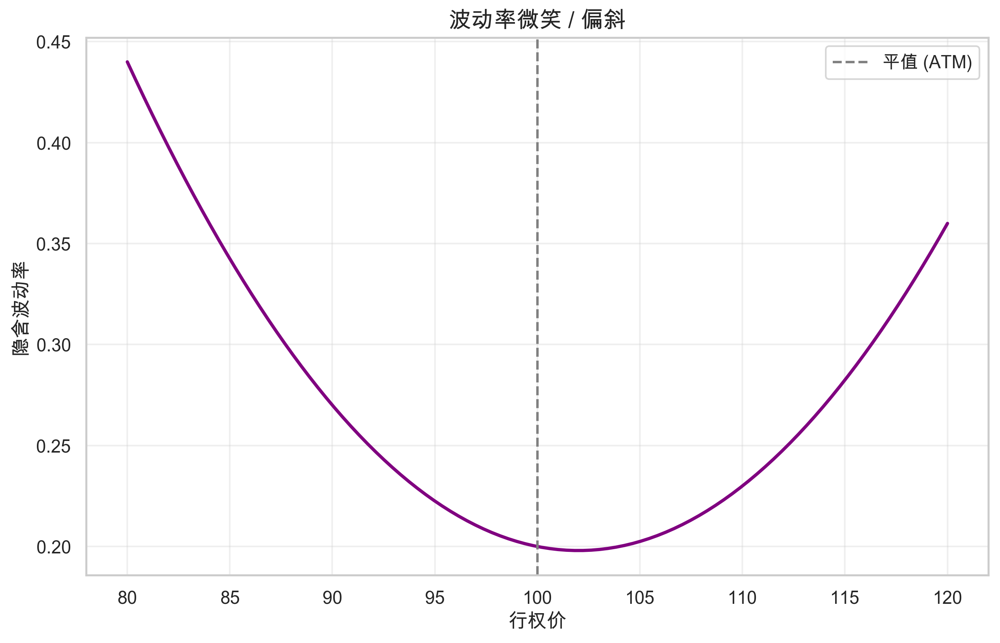

# 第十章：波动率策略

> **核心问题**：波动率为什么可以交易？波动率策略的理论基础是什么？

---

## 核心概念定义

### 什么是波动率？



**波动率 (Volatility)** 衡量资产价格变动的剧烈程度。如果把价格走势比作心电图，波动率就是心跳的剧烈程度——平稳的心跳波动率低，剧烈跳动的波动率高。

**两种主要度量方式**：

1. **历史波动率 (Historical/Realized Volatility)**：基于过去价格计算的实际波动

$$\sigma_{realized} = \sqrt{\frac{252}{n} \sum_{i=1}^{n} (r_i - \bar{r})^2}$$

其中：
- $r_i$ = 第 i 天的收益率
- $\bar{r}$ = 平均收益率
- 252 = 年化因子（交易日天数）
- n = 样本天数

2. **隐含波动率 (Implied Volatility)**：从期权价格反推出市场对未来波动的预期

**举例**：
- 历史波动率：过去30天，股票A每天平均涨跌1%，股票B每天平均涨跌3%。B的历史波动率是A的3倍
- 隐含波动率：同样执行价的期权，如果市场预期未来波动大，期权价格会更贵，反推出的隐含波动率就更高

### 什么是波动率风险溢价？

**波动率风险溢价 (Volatility Risk Premium, VRP)** 是指隐含波动率系统性地高于随后实现的波动率的现象。

$$VRP = IV - RV_{realized}$$

其中：
- IV = 隐含波动率
- $RV_{realized}$ = 随后实际发生的波动率

**通俗解释**：这就像保险费总是高于平均理赔额。买期权的人为了对冲风险，愿意支付"溢价"；卖期权的人承担风险，获得这个溢价作为补偿。

**例子**：
- 你买入1个月期限的沪深300指数期权，隐含波动率是25%
- 一个月后，实际发生的波动率只有20%
- 这5%的差额就是卖出期权的人获得的波动率风险溢价

---

## 一、波动率的统计特性

波动率不是随机游走的，它有几个重要的统计特性，这些特性是波动率策略的理论基础。

### 1.1 波动率聚集 (Volatility Clustering)

**定义**：高波动率往往跟随高波动率，低波动率往往跟随低波动率。

**统计表现**：收益率的绝对值或平方值存在显著的自相关性。

**例子**：
- 2020年3月：新冠疫情爆发，VIX指数从15飙升至82
- 接下来几周：即使没有新的重大消息，市场仍然剧烈波动
- 原因：恐慌情绪需要时间消退，做市商扩大报价，杠杆强平引发连锁反应

**数学刻画**（GARCH模型）：

$$\sigma_t^2 = \omega + \alpha \epsilon_{t-1}^2 + \beta \sigma_{t-1}^2$$

其中：
- $\sigma_t^2$ = t时刻的条件方差
- $\epsilon_{t-1}^2$ = 上一期的收益率平方（新信息）
- $\sigma_{t-1}^2$ = 上一期的条件方差（历史波动）
- $\alpha + \beta$ 接近1表示波动率有很强的持续性

### 1.2 均值回归 (Mean Reversion)

**定义**：波动率虽然会聚集，但长期来看会回归到某个"正常"水平。

**例子**：
- VIX指数的长期均值约为19-20
- 当VIX飙升到40以上，历史上总会在几周到几个月内回落
- 当VIX跌到12以下，往往预示着即将来临的波动

| VIX水平 | 含义 | 历史经验 |
|--------|------|---------|
| < 12 | 极度平静 | 往往预示风暴来临 |
| 12-20 | 正常区间 | 市场相对稳定 |
| 20-30 | 中等紧张 | 存在一定不确定性 |
| > 30 | 恐慌 | 通常在重大事件后出现 |
| > 50 | 极度恐慌 | 历史上很少见，如2008年、2020年 |

**交易含义**：波动率的均值回归特性意味着可以在高波动时卖出波动率（预期回落），在低波动时买入波动率（预期上升）。

### 1.3 非对称性 (Asymmetry)

**定义**：波动率对下跌的反应比对上涨更剧烈。

**杠杆效应 (Leverage Effect)**：当股价下跌时，公司的杠杆率（债务/股权）上升，风险增加，波动率上升。

**数据证据**：
- 标普500指数下跌1%，VIX平均上升约4-5%
- 标普500指数上涨1%，VIX平均下降约2-3%

**例子**：
- 2020年2月-3月：标普500下跌34%，VIX从15升至82（上涨447%）
- 2020年3月-8月：标普500上涨51%，VIX从82降至22（下降73%）

上涨比下跌幅度更大，但VIX的下降幅度远小于之前的上升幅度——这就是非对称性。

### 1.4 期限结构 (Term Structure)

**定义**：不同到期日期权隐含的波动率可能不同，形成波动率的期限结构。

**两种形态**：

| 形态 | 特征 | 出现场景 |
|-----|------|---------|
| **Contango（正向）** | 远期IV > 近期IV | 正常市场状态 |
| **Backwardation（反向）** | 近期IV > 远期IV | 市场恐慌时 |

**例子**：
- 正常情况：1个月IV=18%，3个月IV=20%，6个月IV=22%
  - 解释：时间越长，不确定性越大，合理
- 恐慌时期：1个月IV=45%，3个月IV=35%，6个月IV=28%
  - 解释：市场认为短期风险极高，但长期会恢复正常

---

## 二、波动率风险溢价的来源

为什么隐含波动率总是系统性地高于实现波动率？这不是市场定价错误，而是有深刻的经济学原因。

### 2.1 保险需求理论

**核心思想**：投资者愿意为下跌保护支付溢价，就像愿意为房屋保险支付费用一样。

**为什么需要保险？**

1. **风险厌恶**：亏损的痛苦大于盈利的快乐
2. **负债驱动**：养老金、保险公司有固定支付义务，不能承受大幅亏损
3. **职业风险**：基金经理因大幅回撤可能被解雇

**例子**：
- 某养老金持有100亿股票组合
- 如果市场下跌20%，亏损20亿，可能无法支付退休金
- 买入看跌期权的成本：每年约2%（2亿）
- 理性选择：宁可每年付2亿"保险费"，也不愿承担20亿的潜在亏损

**市场均衡**：因为买保险的需求大于卖保险的供给，期权价格被推高，形成波动率风险溢价。

### 2.2 方差风险的系统性

**核心思想**：波动率与市场收益负相关，是一种系统性风险，应该获得风险溢价。

**逻辑链条**：
1. 波动率在市场下跌时飙升（负相关）
2. 卖出波动率 = 在最糟糕的时候承担损失
3. 承担这种"雪上加霜"的风险，应该获得补偿

**数据证据**：VIX与标普500的相关系数约为-0.7至-0.8，是所有资产中与股市负相关最强的。

**例子**：
- 你卖出看跌期权，收取权利金
- 正常时期：期权到期作废，你获得权利金
- 市场崩盘：期权被行权，你在最低点被迫买入
- 这意味着你在最不需要钱的时候赚钱，在最需要钱的时候亏钱
- 承担这种风险，理应获得长期正收益

### 2.3 行为因素

**过度恐惧 (Overreaction to Fear)**：

投资者对尾部风险的恐惧往往超过理性水平。

**证据**：
- 深度虚值看跌期权的隐含波动率特别高（"波动率微笑"）
- 这意味着市场对极端下跌的恐惧被过度定价

**例子**：
- 标普500指数在3000点
- 执行价2400（下跌20%）的看跌期权，隐含波动率30%
- 执行价1800（下跌40%）的看跌期权，隐含波动率50%
- 历史上，下跌40%的极端事件非常罕见，但市场愿意为这种"尾部保险"支付极高溢价

### 2.4 结构性供需失衡

**卖方稀缺**：

| 参与者类型 | 行为 | 原因 |
|-----------|------|------|
| 散户 | 买期权 | 以小博大，杠杆效应 |
| 对冲基金 | 买看跌期权 | 对冲尾部风险 |
| 养老金 | 买看跌期权 | 负债驱动，合规要求 |
| 做市商 | 被动提供流动性 | 不主动持有方向 |

**结果**：几乎所有参与者都是期权的净买家，卖方供给不足，推高期权价格和隐含波动率。

---

## 三、波动率策略类型

### 3.1 卖出波动率（收割VRP）

**核心思想**：通过卖出期权，赚取隐含波动率与实现波动率之间的差额。

**常见策略**：

| 策略 | 操作 | 风险收益特征 |
|-----|------|-------------|
| 卖出跨式 (Short Straddle) | 卖出ATM看涨+看跌 | 高权利金，双向风险 |
| 卖出宽跨式 (Short Strangle) | 卖出OTM看涨+看跌 | 较高胜率，尾部风险 |
| 卖出看跌 (Short Put) | 卖出OTM看跌 | 类似"保险公司"，方向性暴露 |
| 备兑开仓 (Covered Call) | 持有现货+卖出看涨 | 降低波动，限制上行 |

**例子：卖出宽跨式**
- 股票价格：100元
- 卖出执行价90的看跌期权，收取权利金2元
- 卖出执行价110的看涨期权，收取权利金2元
- 总收入：4元
- 盈利区间：86-114（即股价在这个区间内都能盈利）
- 最大亏损：无限（如果股价暴涨或暴跌）

**收益分布**：

```
收益
  ^
  |      ___________
  |     /           \
  |----/-------------\-----> 股价
  |   86            114
  |  /               \
  | /                 \
  |/                   \
```

**关键特征**：大部分时间小赚，偶尔大亏——典型的"捡硬币在蒸汽压路机前"。

### 3.2 波动率套利

**思路**：利用隐含波动率的定价偏差获利，而非单纯收割VRP。

**跨期套利 (Calendar Spread)**：

当期限结构异常时，买入低估的期限，卖出高估的期限。

**例子**：
- 正常情况：3个月IV > 1个月IV
- 异常情况：1个月IV = 25%，3个月IV = 22%（反向结构太极端）
- 操作：卖出1个月期权，买入3个月期权
- 盈利来源：期限结构恢复正常

**跨品种套利**：

当两个相关资产的隐含波动率出现异常价差时。

**例子**：
- 沪深300ETF期权IV = 25%
- 沪深300股指期权IV = 28%
- 两者标的相同，理论上IV应该接近
- 操作：卖出高IV的，买入低IV的

**波动率微笑套利**：

当不同执行价期权的隐含波动率曲线出现异常时。

**例子**：
- 正常微笑：低执行价IV高，高执行价IV低，中间最低
- 异常情况：某个执行价的IV明显偏离平滑曲线
- 操作：买入低估的执行价，卖出高估的执行价

### 3.3 方差互换 (Variance Swap)

**定义**：直接交易实现波动率与约定波动率之间差额的衍生品。

**结构**：
- 买方：获得 $N \times (RV^2 - K^2)$
- 卖方：获得 $N \times (K^2 - RV^2)$

其中：
- N = 名义本金
- RV = 实现波动率
- K = 约定的行权波动率（类似于隐含波动率）

**优势**：
- 纯粹暴露于波动率，无需管理Delta
- 无需频繁调整头寸
- 可以直接表达对波动率的观点

**例子**：
- 你认为市场实际波动会超过市场预期
- 当前方差互换的行权波动率K = 20%
- 你买入方差互换，名义本金1000万
- 如果实际波动率RV = 25%
- 盈利 = 1000万 × (25%² - 20%²) = 1000万 × 2.25% = 22.5万

### 3.4 VIX产品交易

**VIX指数**：衡量标普500指数未来30天预期波动率的指标，被称为"恐惧指数"。

**可交易产品**：

| 产品 | 特征 | 适用场景 |
|-----|------|---------|
| VIX期货 | 跟踪VIX预期值 | 短期对冲、投机 |
| VIX期权 | 波动率的波动率 | 尾部对冲 |
| VIX ETN | 滚动VIX期货 | 散户参与 |
| 反向VIX ETN | 做空波动率 | 收割VRP |

**重要警告：滚动损耗**

VIX产品通常处于Contango状态（远期高于近期），持有VIX多头需要不断从低价卖出近月、高价买入远月，造成持续损耗。

**例子**：
- VXX（VIX短期期货ETN）从2009年发行以来下跌超过99%
- 不是因为VIX本身下跌了99%，而是滚动损耗
- 这就是为什么长期做多VIX几乎必然亏损

**反向策略的风险**：

- SVXY（做空VIX的ETN）在2018年2月5日一天暴跌96%
- 原因：VIX指数单日从17飙升至50
- 教训：做空波动率在极端事件中可能毁灭性亏损

---

## 四、波动率微笑与偏斜

### 4.1 什么是波动率微笑？

**定义**：在同一到期日，不同执行价期权的隐含波动率呈现出"微笑"或"偏斜"的形状。

**图示**：

```
IV (隐含波动率)
  ^
  |  \                 /
  |   \               /
  |    \             /
  |     \___________/
  |
  +-------------------------> 执行价
      OTM Put   ATM   OTM Call
```

**标准偏斜（股票市场）**：
- 低执行价（OTM看跌）IV最高
- 平值附近IV最低
- 高执行价（OTM看涨）IV较低或略升

### 4.2 偏斜的成因

**需求因素**：
- 机构投资者大量买入OTM看跌期权对冲
- 推高低执行价期权价格和隐含波动率

**风险因素**：
- 市场下跌时波动率上升（杠杆效应）
- 低执行价期权在市场下跌时更可能被行权
- 理性定价应该反映这种风险

**历史数据**：
- 1987年股灾前：波动率微笑几乎对称
- 1987年股灾后：明显偏斜，低执行价IV大幅上升
- 市场"记住"了尾部风险

### 4.3 偏斜交易

**偏斜套利**：当偏斜程度异常时进行交易。

**例子**：
- 正常偏斜：90%执行价IV比100%执行价IV高5%
- 当前偏斜：90%执行价IV比100%执行价IV高10%（异常陡峭）
- 操作：卖出90%执行价看跌，买入100%执行价看跌
- 盈利来源：偏斜恢复正常

**风险提示**：偏斜可能因为市场知道某些风险而存在，不要轻易认为市场定价错误。

---

## 五、期权组合策略

### 5.1 方向中性策略

**跨式 (Straddle)**：同时买入（或卖出）ATM看涨和看跌

| 头寸 | 观点 | 盈利条件 |
|-----|------|---------|
| 买入跨式 | 预期大幅波动 | 价格大幅上涨或下跌 |
| 卖出跨式 | 预期窄幅震荡 | 价格保持稳定 |

**例子（买入跨式）**：
- 股价100元，买入100执行价的看涨和看跌各一份
- 总成本：8元（假设各4元）
- 盈亏平衡点：92元和108元
- 如果股价涨到120元或跌到80元，盈利12元

**蝶式 (Butterfly)**：三个执行价的组合，在中间执行价盈利最大

**例子（卖出蝶式）**：
- 卖出1份执行价90的看涨
- 买入2份执行价100的看涨
- 卖出1份执行价110的看涨
- 如果到期时股价在100附近，亏损最大
- 如果股价远离100，盈利

**铁秃鹰 (Iron Condor)**：宽跨式+保护翼的组合

**结构**：
- 卖出OTM看跌（如90执行价）
- 买入更OTM看跌（如85执行价）——保护
- 卖出OTM看涨（如110执行价）
- 买入更OTM看涨（如115执行价）——保护

**优势**：限制了最大亏损，适合稳定市场

### 5.2 波动率方向策略

**做多波动率**：预期波动率上升

| 策略 | 操作 | 特点 |
|-----|------|-----|
| 买入跨式 | 买入ATM Call + Put | 需要大幅波动才能盈利 |
| 买入日历价差 | 卖近买远 | 利用远期Vega更大 |
| 买入VIX Call | 直接看涨VIX | 有滚动损耗风险 |

**做空波动率**：预期波动率下降

| 策略 | 操作 | 特点 |
|-----|------|-----|
| 卖出跨式 | 卖出ATM Call + Put | 无限风险，需要保证金 |
| 卖出日历价差 | 买近卖远 | 风险相对有限 |
| 做空VIX | 通过VIX Put或反向ETN | 极端风险巨大 |

---

## 六、波动率策略的风险

### 6.1 尾部风险 (Tail Risk)

**核心问题**：卖出波动率策略大部分时间赚小钱，但极端情况下亏大钱。

**历史案例**：

| 事件 | 日期 | VIX变化 | 卖出波动率策略损失 |
|-----|------|---------|------------------|
| 黑色星期一 | 1987.10.19 | - | 一天市场下跌22% |
| LTCM崩溃 | 1998.08 | 翻倍 | 数周亏损数十亿 |
| 金融危机 | 2008.09-10 | 从20到80 | 多家对冲基金关闭 |
| 新冠疫情 | 2020.02-03 | 从15到82 | XIV/SVXY暴跌 |

**XIV事件详解**：
- XIV是做空VIX的ETN产品
- 2018年2月5日，VIX单日从17飙升至50
- XIV净值从2月2日的99美元跌至2月5日的4.22美元
- 一天亏损96%，随后被强制清盘
- 很多投资者几年的收益一天归零

### 6.2 跳跃风险 (Jump Risk)

**定义**：价格不连续跳跃，无法通过Delta对冲保护。

**例子**：
- 你卖出看跌期权，Delta对冲做多股票
- 正常情况：股价慢慢下跌，你不断增加股票对冲
- 跳跃情况：隔夜出重大利空，股票开盘直接跌停
- 你没有机会调整对冲，直接承担全部损失

**为什么对冲不管用？**

理论上的Delta对冲假设：
- 价格连续变动
- 可以随时交易
- 无交易成本

现实中：
- 隔夜/周末无法交易
- 极端行情可能熔断或跌停
- 流动性枯竭时买不到或卖不出

### 6.3 Gamma风险

**定义**：临近到期时，Gamma急剧增加，价格小幅变动会导致Delta大幅变化。

**例子**：
- 期权还有1天到期，执行价100，股价99
- 此时Gamma非常大
- 股价从99涨到101，期权从虚值变成实值
- Delta从接近0变成接近1
- 如果你卖出了这个期权，需要在极短时间内买入大量股票对冲

**临近到期的"针尖效应"**：

```
Gamma
  ^
  |        /\
  |       /  \
  |      /    \
  |_____/      \_____
  +-------------------> 到期时间
    1月   1周  1天
```

### 6.4 流动性风险

**正常市场**：
- 买卖价差小
- 可以随时平仓

**极端市场**：
- 买卖价差急剧扩大
- 可能找不到对手方
- 被迫以极差价格平仓

**例子**：
- 正常时期：期权买卖价差0.05元
- 恐慌时期：价差扩大到1元甚至更多
- 如果你需要平仓，成本可能吃掉大部分利润

### 6.5 模型风险

**Black-Scholes模型假设**：
- 波动率恒定
- 价格连续变动
- 正态分布

**现实情况**：
- 波动率随时间变化
- 存在跳跃
- 收益率呈现厚尾分布

**后果**：基于错误模型的对冲可能完全失效。

---

## 七、实证证据

### 7.1 波动率风险溢价的存在性

**学术研究**：

| 研究 | 样本期 | 主要发现 |
|-----|-------|---------|
| Coval & Shumway (2001) | 1990-1995 | 卖出跨式平均月收益3%+ |
| Bakshi & Kapadia (2003) | 1988-1995 | Delta对冲后仍有显著正收益 |
| Carr & Wu (2009) | 1996-2003 | 方差互换卖方平均年化收益15%+ |

**关键发现**：
- VRP长期存在，平均约每月1-2%
- 但分布极度偏斜，有大幅回撤
- 经过风险调整后，收益仍然显著

### 7.2 策略表现

**CBOE策略指数表现**（2006-2020）：

| 策略 | 年化收益 | 年化波动 | 最大回撤 | 夏普比率 |
|-----|---------|---------|---------|---------|
| 买入持有(SPY) | 8.5% | 19% | -55% | 0.45 |
| BuyWrite (BXM) | 6.2% | 13% | -36% | 0.48 |
| PutWrite (PUT) | 7.1% | 11% | -33% | 0.65 |

**解读**：
- 卖出期权策略收益略低于买入持有
- 但波动率和最大回撤明显更小
- 风险调整后收益（夏普比率）更高
- 本质上是用上行潜力换取了稳定性

### 7.3 长期数据

**1928-2020年Put卖出策略回测**：
- 年化收益约9.5%（vs SPX 9.7%）
- 年化波动约11%（vs SPX 19%）
- 夏普比率约0.60（vs SPX 0.40）
- 最大回撤约-35%（vs SPX -84%）

**结论**：长期来看，卖出波动率可以获得类似股票的收益，但波动更小。代价是偶尔的大幅回撤。

---

## 八、实践启示

### 8.1 策略容量

**容量限制因素**：

| 因素 | 影响 |
|-----|------|
| 期权市场流动性 | 大额交易会显著影响价格 |
| 保证金要求 | 卖出期权需要大量保证金 |
| 滑点成本 | 成交价格与理论价格的差异 |
| 风险承受能力 | 需要承受偶发的大幅亏损 |

**估计**：单一策略在主要指数期权市场的容量约几十亿美元，超过后会显著侵蚀收益。

### 8.2 风险管理原则

**头寸规模**：
- 永远不要把全部资本用于卖出波动率
- 典型配置：10-30%的资本用于波动率策略
- 留足现金应对保证金追加

**止损设置**：
- 预设最大亏损限额
- 达到限额立即平仓，不要期望反弹
- 宁可错过反弹，也不要被彻底消灭

**分散化**：
- 跨市场：股票、商品、外汇
- 跨期限：不同到期日的期权
- 跨策略：结合买入和卖出策略

### 8.3 极端事件应对

**提前准备**：
- 持有部分尾部对冲（如深度虚值看跌）
- 定期检查压力测试结果
- 制定极端情况下的操作预案

**事件发生时**：
- 不要恐慌性平仓（可能卖在最差价格）
- 评估实际损失vs账面损失
- 如果基本面没变，考虑加仓

**例子**：2020年3月VIX飙升到80，很多卖出波动率的策略亏损严重。但如果能坚持持有（前提是头寸规模合理），几个月后VIX回落到20，大部分亏损都能收回。

### 8.4 波动率策略适合什么人？

**适合**：
- 理解非对称风险的专业投资者
- 有足够资本承受回撤的机构
- 追求稳定收益、愿意牺牲上行的投资者
- 有风险管理能力的交易者

**不适合**：
- 追求快速致富的投机者
- 无法承受偶发大额亏损的个人
- 对期权定价不熟悉的初学者
- 杠杆过高的交易者

---

## 九、总结

### 核心要点

1. **波动率风险溢价确实存在**：隐含波动率系统性高于实现波动率，这是可以获取的风险溢价

2. **本质是保险生意**：卖出波动率类似于卖保险——大部分时间收保费，偶尔赔大钱

3. **统计特性是基础**：波动率的聚集性、均值回归、非对称性是策略设计的依据

4. **风险不可忽视**：尾部风险、跳跃风险、流动性风险可以让多年收益一夜归零

5. **风险管理是核心**：合理的头寸规模、止损纪律、尾部对冲是生存的关键

### 关键公式

| 概念 | 公式 |
|-----|------|
| 波动率风险溢价 | $VRP = IV - RV$ |
| 方差互换收益 | $Payoff = N \times (RV^2 - K^2)$ |
| GARCH模型 | $\sigma_t^2 = \omega + \alpha \epsilon_{t-1}^2 + \beta \sigma_{t-1}^2$ |

### 投资启示

1. **不要贪婪**：卖出波动率的收益是有限的，但风险可能是无限的
2. **保持敬畏**：市场可以比你保持理性更长时间保持非理性
3. **分散配置**：波动率策略只是资产配置的一部分
4. **长期视角**：接受偶发的大幅回撤，着眼长期平均收益

---

## 加密货币市场的特殊考量

加密货币市场的波动率特征与传统市场有显著差异。

### 波动率水平

| 资产 | 典型年化波动率 |
|------|---------------|
| 美国国债 | 5-8% |
| 标普500 | 15-20% |
| 比特币 | 60-80% |
| 山寨币 | 100-200%+ |

### 独特的波动率产品

**永续合约资金费率**：

资金费率本质上反映了市场对方向的偏好，与波动率预期相关：
- 极端正费率：市场过度看多
- 极端负费率：市场过度看空

**隐含波动率特征**：
- 加密期权市场（Deribit）的 IV 通常远高于传统市场
- 波动率微笑更陡峭
- 期限结构常呈倒挂（短期 > 长期）

### 策略调整

| 传统市场 | 加密市场 |
|---------|---------|
| VRP 年化 3-5% | VRP 年化 10-20%+ |
| 卖出波动率相对安全 | 尾部风险更极端 |
| 期权流动性好 | 期权流动性有限 |

> **启示**：加密市场的高波动率创造了更大的 VRP 机会，但尾部事件频率也更高。卖出波动率策略需要更保守的仓位规模。
>
> 详见 [第十二章：加密货币市场](12_cryptocurrency_markets.md)

---

## 参考文献

1. **Taleb, N. N.** (1997). *Dynamic Hedging: Managing Vanilla and Exotic Options*
2. **Coval, J. D., & Shumway, T.** (2001). "Expected Option Returns"
3. **Bakshi, G., & Kapadia, N.** (2003). "Delta-Hedged Gains and the Negative Market Volatility Risk Premium"
4. **Carr, P., & Wu, L.** (2009). "Variance Risk Premiums"
5. **Sinclair, E.** (2010). *Option Trading: Pricing and Volatility Strategies and Techniques*
6. **Gatheral, J.** (2006). *The Volatility Surface: A Practitioner's Guide*
7. **Bennett, C.** (2014). *Trading Volatility*

---

*（可选章节）*
