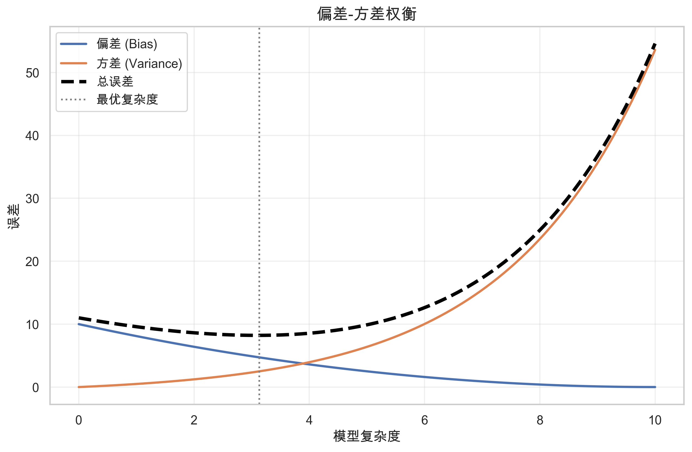
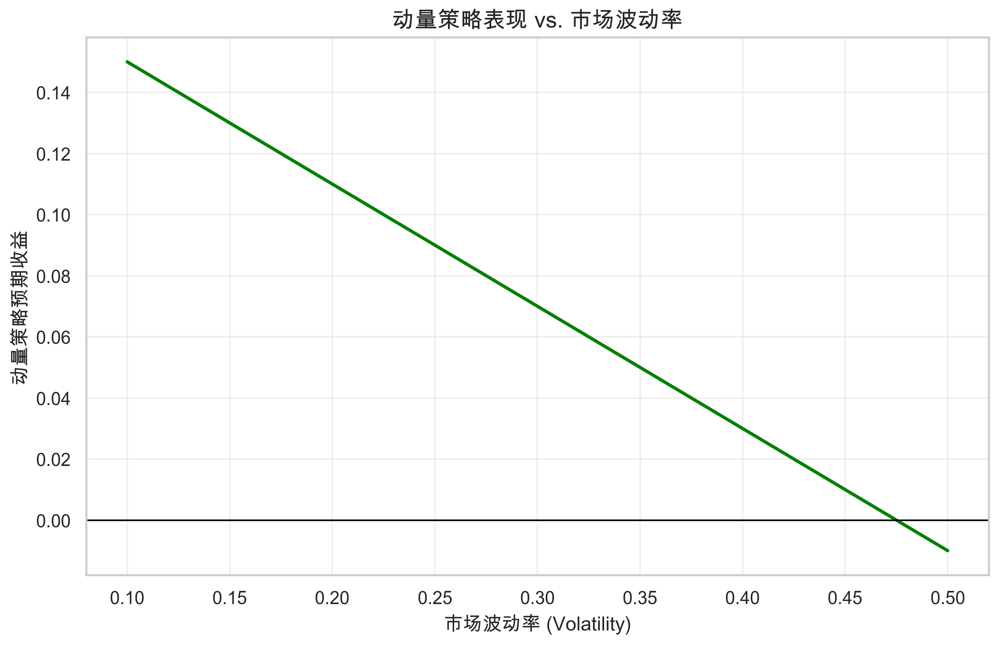
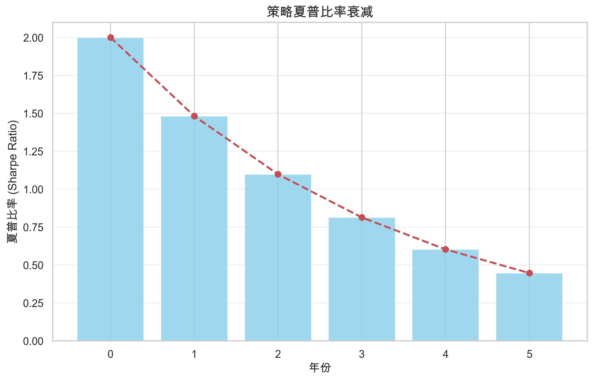

# 第十一章：机器学习与量化交易

> **核心问题**：机器学习能否发现传统方法无法捕捉的Alpha？非线性模型的理论基础是什么？

---

## 核心概念定义

### 什么是机器学习？

**机器学习 (Machine Learning)** 是让计算机从数据中自动学习规律的方法，无需人工编写具体规则。

**与传统统计方法的区别**：

| 维度 | 传统统计 | 机器学习 |
|-----|---------|---------|
| 出发点 | 假设驱动（先有理论） | 数据驱动（从数据发现） |
| 模型复杂度 | 通常简单（如线性回归） | 可以非常复杂 |
| 目标 | 推断、解释因果 | 预测、模式识别 |
| 变量选择 | 人工基于理论 | 自动选择 |

**举例**：
- 传统方法：经济学理论说低市盈率股票应该有更高收益，于是构建P/E因子
- 机器学习：给算法几百个变量，让它自己发现哪些组合最能预测收益

### 什么是过拟合？

**过拟合 (Overfitting)** 是指模型学习了训练数据中的噪声而非真实规律，导致在新数据上表现很差。

**通俗解释**：就像一个学生背答案而不是理解原理——考试时遇到原题得满分，换个题就不会了。

**例子**：
- 你用过去10年的数据训练模型
- 模型发现"每年12月15日买入科技股，12月20日卖出"能获得50%年化收益
- 这可能只是历史上的巧合
- 用这个"规律"去交易，很可能亏钱

### 偏差-方差权衡 (Bias-Variance Tradeoff)

模型的预测误差可以分解为两部分：

$$Error = Bias^2 + Variance + Noise$$

| 成分 | 含义 | 例子 |
|-----|------|-----|
| **偏差 (Bias)** | 模型过于简单，无法捕捉真实规律 | 用直线拟合曲线关系 |
| **方差 (Variance)** | 模型过于复杂，对训练数据太敏感 | 换一批数据，结果完全不同 |
| **噪声 (Noise)** | 数据本身的随机性，无法消除 | 市场的不可预测部分 |

**图示**：



**实际含义**：
- 简单模型（如线性回归）：高偏差，低方差——可能错过复杂规律，但至少稳定
- 复杂模型（如深度神经网络）：低偏差，高方差——能拟合任何东西，但可能只是噪声

---

## 一、为什么需要机器学习？

### 1.1 金融数据的非线性特征

传统金融模型假设线性关系，但现实中存在大量非线性。

**例子1：动量与波动率的交互**



- 低波动率环境：动量效应弱
- 高波动率环境：动量效应强，但太极端会反转
- 线性模型无法捕捉这种交互关系

**例子2：价值因子的阈值效应**

| P/B分位 | 传统线性假设 | 实际表现 |
|--------|-------------|---------|
| 0-20% | 最高收益 | 包含价值陷阱，收益不稳定 |
| 20-40% | 较高收益 | 实际上最稳定的超额收益 |
| 40-60% | 中等收益 | 符合预期 |
| 60-100% | 低收益 | 符合预期 |

线性模型假设P/B越低越好，但实际上最便宜的股票反而表现不稳定（价值陷阱）。

### 1.2 高维数据的处理

**维度灾难**：当特征数量很多时，传统统计方法失效。

**例子**：
- 你有200个候选因子
- 传统回归需要的样本量 > 因子数量的数倍
- 以月度数据计算，需要600个月以上的数据（50年）
- 但很多因子只有20-30年历史

**机器学习的优势**：
- 正则化技术（如LASSO、Ridge）可以处理高维数据
- 能自动进行特征选择
- 可以发现人类难以想到的因子组合

### 1.3 另类数据的兴起

**另类数据 (Alternative Data)**：传统财务报表之外的数据源。

| 数据类型 | 例子 | 特点 |
|---------|------|------|
| 文本数据 | 新闻、社交媒体、分析师报告 | 非结构化，需要NLP处理 |
| 图像数据 | 卫星图像、店铺人流 | 需要计算机视觉 |
| 交易数据 | 订单流、高频价格 | 数据量巨大 |
| 传感器数据 | IoT设备、位置数据 | 实时更新 |

**传统方法无法处理的原因**：
- 数据量太大（每天数百万条新闻）
- 非结构化（文本、图像）
- 关系复杂（需要上下文理解）

**例子：新闻情感分析**
- 传统方法：人工阅读新闻，判断是利好还是利空
- 机器学习：训练模型自动分类，每秒处理数千条新闻
- 结果：可以在新闻发布几毫秒内做出交易决策

---

## 二、主要方法与应用

### 2.1 监督学习

**定义**：有标签的数据，学习输入(X)到输出(Y)的映射关系。

**在量化中的应用**：

| 任务 | 输入(X) | 输出(Y) | 常用算法 |
|-----|--------|--------|---------|
| 收益预测 | 因子值 | 未来收益 | 线性回归、树模型、神经网络 |
| 涨跌分类 | 技术指标 | 涨/跌 | 逻辑回归、随机森林、SVM |
| 违约预测 | 财务指标 | 是否违约 | XGBoost、深度学习 |

**例子：用随机森林预测股票收益**

1. **特征**：100个因子（估值、动量、质量等）
2. **标签**：下个月收益率的分位（前30% = 1，后30% = 0）
3. **训练**：用5年历史数据训练
4. **预测**：输出每只股票上涨的概率
5. **构建组合**：买入概率最高的，卖空概率最低的

**关键问题**：样本外表现通常远低于样本内表现

### 2.2 无监督学习

**定义**：没有标签，从数据中发现结构和模式。

**在量化中的应用**：

| 方法 | 应用 | 目的 |
|-----|------|-----|
| 聚类 (Clustering) | 股票分组 | 发现隐藏的行业/风格 |
| 降维 (PCA) | 因子提纯 | 提取独立的风险因素 |
| 异常检测 | 市场监控 | 发现异常交易模式 |

**例子：用聚类发现隐藏的股票分组**

- 传统方法：按行业分类（银行、科技、消费等）
- 机器学习：根据收益率相关性自动聚类
- 发现：某些"科技股"与"消费股"的相关性比与同行业股票更高
- 应用：更准确的风险分散

**例子：用PCA提取因子**

假设你有50个估值相关指标（P/E、P/B、EV/EBITDA等）：
- 直接使用：可能存在多重共线性
- PCA处理：提取几个独立的"主成分"
- 结果：第一主成分可能代表"整体估值水平"，第二主成分代表"成长vs价值"

### 2.3 强化学习

**定义**：智能体通过与环境交互，学习最优行动策略。

**与监督学习的区别**：

| 维度 | 监督学习 | 强化学习 |
|-----|---------|---------|
| 反馈 | 立即知道对错 | 延迟反馈（交易结束才知道盈亏） |
| 目标 | 预测准确 | 累积回报最大 |
| 数据 | 固定数据集 | 通过行动产生数据 |

**在量化中的应用**：

| 场景 | 状态 | 行动 | 奖励 |
|-----|------|------|-----|
| 订单执行 | 市场状态、剩余数量 | 挂单价格、数量 | 执行成本 |
| 做市 | 订单簿状态 | 买卖报价 | 价差收益 - 库存风险 |
| 组合管理 | 持仓、市场状态 | 买入/卖出/持有 | 风险调整收益 |

**例子：用强化学习优化订单执行**

- 任务：在一天内卖出100万股，最小化市场冲击
- 状态：已执行数量、剩余时间、当前价格、波动率
- 行动：每5分钟卖出多少股
- 奖励：卖出价格与VWAP的差异

传统方法（如TWAP）简单平均分配，但强化学习可以学会：
- 在流动性好时多卖
- 在价格反弹时多卖
- 在波动大时谨慎

### 2.4 深度学习

**定义**：多层神经网络，能自动学习复杂的特征表示。

**架构类型**：

| 架构 | 特点 | 适用场景 |
|-----|------|---------|
| 多层感知器 (MLP) | 通用非线性映射 | 因子组合、收益预测 |
| 卷积神经网络 (CNN) | 捕捉局部模式 | K线图识别、订单簿分析 |
| 循环神经网络 (RNN/LSTM) | 处理序列数据 | 时间序列预测 |
| Transformer | 注意力机制 | 长序列、多资产关系 |

**例子：LSTM预测收益率**

```
输入序列 (过去20天)
[价格, 成交量, 波动率, 动量...]
       ↓
    LSTM层
       ↓
    LSTM层
       ↓
    全连接层
       ↓
输出: 下一天收益预测
```

**深度学习的挑战**：
- 需要大量数据（金融数据相对稀缺）
- 容易过拟合
- 可解释性差（"黑箱"）
- 对超参数敏感

---

## 三、机器学习在量化中的真实表现

### 3.1 学术研究证据

**正面证据**：

| 研究 | 方法 | 主要发现 |
|-----|------|---------|
| Gu et al. (2020) | 神经网络 | 比线性模型提高R²约2倍 |
| Feng et al. (2020) | 深度学习 | 能发现新的定价因子 |
| Chen et al. (2019) | 梯度提升树 | 预测横截面收益显著 |

**负面证据**：

| 研究 | 方法 | 主要发现 |
|-----|------|---------|
| Arnott et al. (2019) | 多种ML | 样本外衰减严重 |
| Harvey & Liu (2020) | 因子挖掘 | 大部分ML因子是噪声 |
| Leippold et al. (2021) | 深度学习 | 考虑交易成本后alpha不显著 |

### 3.2 样本外表现的普遍规律

**典型模式**：



**衰减原因**：

1. **过拟合**：学到了噪声而非信号
2. **机制变化**：市场结构不断演变
3. **拥挤交易**：同样的信号被更多人发现
4. **交易成本**：回测低估了实际成本

**经验法则**：
- 样本内夏普2.0 → 样本外可能只有0.5
- 衰减幅度50-80%是常见的
- 复杂模型衰减更严重

### 3.3 与传统因子的关系

**机器学习能否发现新的alpha？**

| 观点 | 论据 |
|-----|------|
| **乐观** | ML可以发现非线性关系和因子交互 |
| **悲观** | 大部分ML alpha可以被传统因子解释 |
| **中立** | ML是更好的因子组合方式，但不产生新因子 |

**实证发现**：
- 约70%的ML预测能力来自已知因子的非线性组合
- 约20%来自因子之间的交互效应
- 只有约10%是真正的"新"信息

**例子**：
- ML模型预测股票A会涨
- 分解后发现：动量因子贡献40%，价值因子贡献30%，两者交互贡献20%，"未知"贡献10%
- 这个"未知"的10%是否是真alpha还是噪声？需要更长样本验证

---

## 四、关键挑战与陷阱

### 4.1 过拟合风险

**金融数据的特殊性**：

| 特点 | 问题 |
|-----|------|
| 信噪比极低 | 真实信号可能只有1%，99%是噪声 |
| 样本量有限 | 即使60年数据，也只有700+月度观察 |
| 非平稳 | 过去的规律可能不再适用 |
| 结构变化 | 市场机制不断演变 |

**过拟合的表现**：

| 信号 | 含义 |
|-----|------|
| 训练/验证差距大 | 模型过于复杂 |
| 不同时期表现悬殊 | 捕捉的是特定时期的噪声 |
| 无法解释的因子 | 可能是数据挖掘的产物 |
| 换数据集失效 | 不是真正的规律 |

**控制方法**：

| 方法 | 原理 | 实践 |
|-----|------|-----|
| 正则化 | 惩罚模型复杂度 | L1/L2正则化 |
| 早停 | 在验证误差上升前停止 | 监控验证集表现 |
| Dropout | 随机丢弃神经元 | 深度学习中使用 |
| 交叉验证 | 多次验证 | 时序分割，不能随机打乱 |
| 集成学习 | 多个模型平均 | 降低单模型方差 |

### 4.2 数据窥探偏差

**定义**：反复用同一数据集测试不同策略，最终找到的"最优"策略可能只是碰巧表现好。

**例子**：
- 你测试了1000个策略
- 即使所有策略都无效，按概率也会有约50个策略p值<0.05
- 你选择了表现最好的那个
- 实际上这个策略没有任何预测能力

**数学解释**：

如果独立测试N个策略，最大t统计量的期望值约为：

$$E[max(t)] \approx \sqrt{2 \ln N}$$

测试1000个策略，期望的最大t值约为3.7，远超传统显著性标准2.0。

**控制方法**：

| 方法 | 操作 |
|-----|------|
| 提高显著性标准 | t > 3.0甚至更高 |
| 多重检验校正 | Bonferroni、FDR校正 |
| 样本外保留 | 留出从未看过的数据做最终测试 |
| 预注册 | 事先确定测试计划 |

### 4.3 时序数据的特殊问题

**不能随机打乱**：

传统机器学习的交叉验证是随机打乱数据，但时序数据不能这样做。

**错误做法**：
```
时间:  1  2  3  4  5  6  7  8  9  10
训练:  X     X     X     X     X
验证:     X     X     X     X     X
```
问题：用未来数据预测过去，造成信息泄露。

**正确做法（Walk-Forward）**：
```
时间:  1  2  3  4  5  6  7  8  9  10
第1轮: [训练] [验证]
第2轮:    [训练] [验证]
第3轮:       [训练] [验证]
```

**Purged K-Fold**：

为避免训练集和验证集之间的信息泄露，需要在分割处设置"间隔期"。

```
[训练集] | 间隔期 | [验证集] | 间隔期 | [训练集]
```

### 4.4 可解释性问题

**为什么重要？**

| 问题 | 后果 |
|-----|------|
| 无法理解预测原因 | 不知道何时会失效 |
| 无法判断合理性 | 可能是虚假相关 |
| 监管要求 | 某些场景需要解释决策 |
| 风险管理 | 不了解敞口来源 |

**例子**：
- 模型预测做空股票A
- 你不知道原因
- 后来发现是因为CEO名字中有某个字母与历史亏损相关
- 这显然是虚假相关

**可解释性方法**：

| 方法 | 原理 | 局限 |
|-----|------|-----|
| 特征重要性 | 计算每个特征的贡献 | 不反映交互效应 |
| SHAP值 | 博弈论方法分解贡献 | 计算成本高 |
| 部分依赖图 | 展示单变量效应 | 假设变量独立 |
| 规则提取 | 从黑箱中提取规则 | 可能丢失复杂关系 |

### 4.5 模型漂移

**定义**：模型预测能力随时间下降。

**原因**：

| 类型 | 解释 | 例子 |
|-----|------|-----|
| 数据漂移 | 输入数据分布变化 | 波动率环境改变 |
| 概念漂移 | 输入与输出关系变化 | 因子效应减弱 |
| 模型老化 | 市场适应了策略 | 拥挤交易 |

**监控指标**：

| 指标 | 警示信号 |
|-----|---------|
| 预测准确率 | 持续下降 |
| 特征分布 | 明显偏离训练期 |
| 收益分布 | 与预期不符 |
| 换手率 | 异常升高 |

**应对策略**：
- 定期重训练（如每月/每季度）
- 滚动窗口训练（只用近期数据）
- 在线学习（持续更新）
- 多模型集成（不同训练期）

---

## 五、实践框架

### 5.1 项目流程

```
1. 问题定义
   ↓
2. 数据收集与清洗
   ↓
3. 特征工程
   ↓
4. 模型选择与训练
   ↓
5. 验证与评估
   ↓
6. 部署与监控
   ↓
7. 迭代优化
```

### 5.2 数据处理

**数据质量问题**：

| 问题 | 影响 | 处理 |
|-----|------|-----|
| 缺失值 | 信息损失 | 插值、删除、标记 |
| 异常值 | 扭曲模型 | 截尾、winsorize |
| 生存偏差 | 高估收益 | 使用包含退市的数据 |
| 前视偏差 | 假的alpha | 严格使用可获取数据 |
| 时间戳错误 | 信息泄露 | 仔细核对数据时点 |

**特征标准化**：

| 方法 | 公式 | 适用场景 |
|-----|------|---------|
| Z-score | $(x-\mu)/\sigma$ | 正态分布特征 |
| Min-Max | $(x-min)/(max-min)$ | 有界特征 |
| 排名分位 | $rank(x)/N$ | 处理异常值 |
| 横截面标准化 | 每期单独标准化 | 时序数据 |

### 5.3 模型选择

**不同场景的推荐**：

| 场景 | 推荐模型 | 原因 |
|-----|---------|-----|
| 小数据量 | 线性模型、LASSO | 避免过拟合 |
| 中等数据 | 随机森林、XGBoost | 性能好，相对稳定 |
| 大数据量 | 深度学习 | 能充分利用数据 |
| 需要解释 | 线性模型、决策树 | 可解释性好 |
| 高频数据 | 轻量级模型 | 延迟要求 |

**集成策略**：

| 方法 | 原理 | 效果 |
|-----|------|-----|
| Bagging | 多个模型平均 | 降低方差 |
| Boosting | 迭代修正错误 | 降低偏差 |
| Stacking | 用模型组合模型 | 综合优势 |
| 简单平均 | 不同方法结果平均 | 最稳健 |

**经验法则**：简单模型的集成通常比复杂单模型更稳健。

### 5.4 验证框架

**多层次验证**：

```
数据集划分:
[训练集 60%] [验证集 20%] [测试集 20%]

训练集: 用于模型训练
验证集: 用于超参数调优、模型选择
测试集: 只用一次，评估最终性能
```

**关键原则**：
- 测试集只能看一次
- 验证集不能影响特征工程
- 使用时序分割而非随机分割
- 考虑多个市场环境（牛市、熊市、震荡）

### 5.5 评估指标

**预测准确性**：

| 指标 | 公式 | 含义 |
|-----|------|-----|
| R² | $1 - SSE/SST$ | 解释的方差比例 |
| IC | $corr(预测, 实际)$ | 预测与实际的相关性 |
| IC_IR | $mean(IC)/std(IC)$ | IC的稳定性 |

**交易表现**：

| 指标 | 含义 | 目标 |
|-----|------|-----|
| 夏普比率 | 风险调整收益 | > 0.5（扣费后）|
| 最大回撤 | 最大峰谷跌幅 | 可承受范围内 |
| 换手率 | 交易频率 | 与收益匹配 |
| 衰减速度 | 样本外表现下降 | 越慢越好 |

**注意**：回测表现必须扣除交易成本才有意义。

---

## 六、机器学习与传统方法的结合

### 6.1 互补关系

| 传统方法优势 | 机器学习优势 |
|------------|-------------|
| 理论基础扎实 | 处理复杂非线性 |
| 可解释性强 | 处理高维数据 |
| 样本需求少 | 自动特征选择 |
| 稳定可靠 | 处理另类数据 |

**最佳实践**：结合两者优势，而非非此即彼。

### 6.2 结合方式

**方式1：传统因子 + ML组合**

```
传统因子 → 机器学习 → 组合权重
(动量、价值等)  (非线性组合)  (最终信号)
```

- 因子基于经济学理论构建
- 用ML学习最优组合方式
- 保持可解释性，提升预测力

**方式2：ML发现 + 理论验证**

```
ML挖掘 → 经济学检验 → 实盘应用
(数据驱动)  (是否有理论支撑)  (只用有解释的因子)
```

- 用ML从数据中发现候选因子
- 检验是否有合理的经济学解释
- 只使用能够解释的因子

**方式3：不同层次使用不同方法**

| 层次 | 方法 | 原因 |
|-----|------|-----|
| 因子构建 | 传统 | 需要经济学逻辑 |
| 因子组合 | ML | 利用非线性关系 |
| 风险模型 | 传统 | 需要稳定性 |
| 执行优化 | ML | 数据量大，适合ML |

### 6.3 实际案例：增强型因子模型

**传统做法**：
$$r = \alpha + \beta_1 \times MOM + \beta_2 \times VAL + \beta_3 \times SIZE + \epsilon$$

**ML增强**：
$$r = f(MOM, VAL, SIZE, MOM \times VAL, MOM^2, ...) + \epsilon$$

其中f是非线性函数（如随机森林、神经网络）。

**改进点**：
- 自动捕捉因子交互（如动量在低波动时更有效）
- 自动识别非线性效应（如价值因子的阈值效应）
- 自适应权重（根据市场环境调整）

---

## 七、实证案例

### 7.1 案例：用XGBoost预测股票收益

**数据**：
- 样本：A股全部股票，2010-2020年
- 频率：月度
- 特征：100个因子（估值、动量、质量、技术等）
- 标签：下月收益率分位

**方法**：
```python
# 伪代码示意
model = XGBClassifier(
    n_estimators=100,
    max_depth=4,
    learning_rate=0.1,
    subsample=0.8,
    reg_lambda=1.0
)

# Walk-forward验证
for train_end in monthly_dates:
    train = data[data.date < train_end]
    test = data[data.date == train_end]
    model.fit(train.X, train.y)
    predictions[train_end] = model.predict_proba(test.X)
```

**结果**：

| 指标 | 样本内 | 样本外 |
|-----|-------|-------|
| IC | 0.08 | 0.03 |
| IC_IR | 1.2 | 0.4 |
| Top-Bottom夏普 | 2.5 | 0.8 |

**发现**：
- 样本外衰减约70%
- 主要预测能力来自动量和质量因子的非线性组合
- 模型在波动率上升期表现更好
- 高换手率侵蚀了大部分收益

### 7.2 案例：LSTM预测高频价格

**数据**：
- 样本：沪深300成分股，2019-2021年
- 频率：分钟级
- 特征：价格、成交量、订单簿数据
- 标签：未来5分钟方向

**模型**：
```
输入: [过去30分钟的特征]
      ↓
  LSTM (64 units)
      ↓
  LSTM (32 units)
      ↓
  Dense (16)
      ↓
输出: 上涨概率
```

**结果**：

| 指标 | 值 |
|-----|---|
| 准确率 | 52.3% |
| 日均交易次数 | 50 |
| 扣费前年化 | 45% |
| 扣费后年化 | 8% |

**发现**：
- 预测准确率仅略高于50%
- 但在高频场景下，微小优势可以积累
- 交易成本是关键（从45%变为8%）
- 模型需要频繁重训练（每周）

---

## 八、总结与启示

### 核心要点

1. **机器学习不是万能药**：金融数据的低信噪比和非平稳性使得ML很容易过拟合

2. **简单模型通常更好**：在样本外，简单模型的表现往往不亚于复杂模型

3. **验证是核心**：时序交叉验证、样本外测试、交易成本考量缺一不可

4. **与传统方法结合**：最好的结果通常来自ML与传统金融理论的结合

5. **持续监控**：模型漂移是常态，需要持续监控和更新

### 实践建议

| 建议 | 原因 |
|-----|------|
| 从简单模型开始 | 建立基准，理解数据 |
| 注重特征工程 | 好特征比好模型更重要 |
| 严格验证 | 过拟合是最大敌人 |
| 考虑成本 | 很多策略扣费后没有alpha |
| 保持怀疑 | 太好的结果通常有问题 |
| 理解模型 | 不用无法解释的信号 |

### 关于"ML Alpha"的冷静思考

1. **大部分ML alpha是已知因子的重新包装**：仔细分析后，约70%可以被传统因子解释

2. **复杂模型的边际贡献有限**：在金融领域，从线性模型到复杂ML的提升通常只有10-30%

3. **交易成本吃掉大部分收益**：很多看起来漂亮的ML策略，扣费后没有alpha

4. **模型衰减比想象的快**：半年前有效的模型，现在可能已经失效

5. **最大的价值可能在另类数据**：ML处理文本、图像等非结构化数据的能力，可能比预测收益更有价值

---

## 参考文献

1. **Gu, S., Kelly, B., & Xiu, D.** (2020). "Empirical Asset Pricing via Machine Learning"
2. **Feng, G., Giglio, S., & Xiu, D.** (2020). "Taming the Factor Zoo: A Test of New Factors"
3. **López de Prado, M.** (2018). *Advances in Financial Machine Learning*
4. **Arnott, R., Harvey, C. R., & Markowitz, H.** (2019). "A Backtesting Protocol in the Era of Machine Learning"
5. **Chen, L., Pelger, M., & Zhu, J.** (2019). "Deep Learning in Asset Pricing"
6. **Harvey, C. R., & Liu, Y.** (2020). "Lucky Factors"
7. **Kakushadze, Z., & Serur, J. A.** (2018). "151 Trading Strategies"

---

*（可选章节）*
