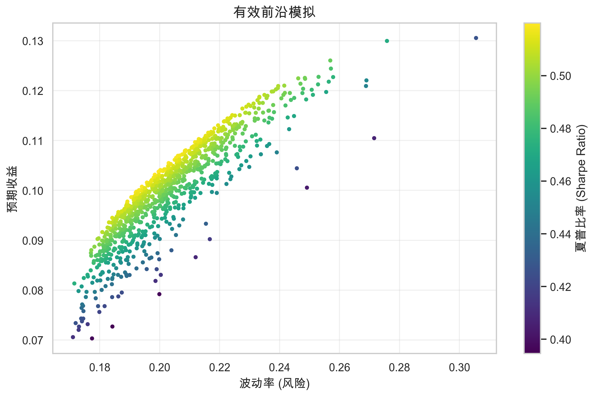

# 第十六章：投资组合理论

> **核心问题**：如何科学地分配资金？分散化真的能降低风险吗？什么是最优的组合配置方式？

---

## 核心概念定义

### 什么是投资组合？



**投资组合 (Portfolio)** 是投资者持有的各类资产的集合。组合理论研究的核心问题是：如何在不同资产之间分配资金，以达到特定的风险-收益目标。

**举例**：
- 简单组合：60%股票 + 40%债券
- 复杂组合：30%美股 + 20%A股 + 20%债券 + 15%商品 + 10%房地产 + 5%现金

### 什么是分散化？

**分散化 (Diversification)** 是通过持有多种不相关的资产来降低组合整体风险的方法。

**核心原理**：当一种资产下跌时，另一种资产可能上涨或持平，从而减少组合的波动。

**数学表示**：

两资产组合的方差：

$$\sigma_p^2 = w_1^2\sigma_1^2 + w_2^2\sigma_2^2 + 2w_1w_2\rho_{12}\sigma_1\sigma_2$$

其中：
- $w_1, w_2$ = 两种资产的权重
- $\sigma_1, \sigma_2$ = 两种资产的标准差
- $\rho_{12}$ = 两种资产的相关系数

**关键洞察**：当 $\rho_{12} < 1$ 时，组合的风险小于各资产风险的加权平均。

**例子**：

| 资产 | 权重 | 波动率 | 相关系数 |
|-----|------|-------|---------|
| 股票 | 50% | 20% | - |
| 债券 | 50% | 5% | 0.2 |

- 如果完全正相关（$\rho=1$）：组合波动率 = 0.5×20% + 0.5×5% = 12.5%
- 实际相关性（$\rho=0.2$）：组合波动率 ≈ 10.6%
- 分散化降低了约15%的风险

### 分散化的"免费午餐"

诺贝尔奖得主Harry Markowitz称分散化是"金融中唯一的免费午餐"——在不降低预期收益的情况下降低风险。

**但有条件**：
- 资产之间的相关性必须小于1
- 危机时相关性往往急剧上升
- 分散化不能消除系统性风险

---

## 一、现代投资组合理论 (MPT)

### 1.1 均值-方差框架

**Harry Markowitz (1952)** 建立了现代投资组合理论的基础：用预期收益（均值）和风险（方差）来描述投资组合。

**核心假设**：
1. 投资者是风险厌恶的
2. 投资者只关心收益的均值和方差
3. 收益服从正态分布
4. 投资者是理性的

**优化目标**：

在给定风险水平下最大化收益，或在给定收益水平下最小化风险。

$$\min_w \frac{1}{2} w^T \Sigma w$$
$$s.t. \quad w^T \mu = \mu_p, \quad w^T \mathbf{1} = 1$$

其中：
- $w$ = 权重向量
- $\Sigma$ = 协方差矩阵
- $\mu$ = 预期收益向量
- $\mu_p$ = 目标组合收益

### 1.2 有效前沿

**有效前沿 (Efficient Frontier)** 是所有"最优"组合的集合——在每个风险水平上，提供最高预期收益的组合。

**图示**：

```
预期收益
    ^
    |           * 最大夏普比率组合
    |          /
    |         / 有效前沿
    |        /
    |       /
    |      *---- 最小方差组合
    |     /
    |----/-------------------------> 风险(标准差)
    |   无效区域
```

**有效前沿上的关键点**：

| 组合 | 特征 | 适用投资者 |
|-----|------|----------|
| 最小方差组合 | 风险最小 | 极度风险厌恶者 |
| 最大夏普组合 | 风险调整收益最优 | 大多数投资者 |
| 高收益组合 | 风险高，收益高 | 激进投资者 |

### 1.3 最优组合的确定

**引入无风险资产后**：

$$E[r_p] = r_f + \frac{E[r_m] - r_f}{\sigma_m} \sigma_p$$

这是**资本市场线 (Capital Market Line, CML)**：一条从无风险利率出发、与有效前沿相切的直线。

**切点组合**就是最优风险资产组合（市场组合）。

**两基金分离定理**：所有投资者都应该持有相同的风险资产组合（切点组合），只是根据风险偏好调整在该组合与无风险资产之间的比例。

**例子**：
- 切点组合：预期收益10%，波动率15%
- 无风险利率：3%
- 保守投资者：50%切点组合 + 50%无风险资产
  - 预期收益 = 0.5×10% + 0.5×3% = 6.5%
  - 波动率 = 0.5×15% = 7.5%
- 激进投资者：150%切点组合（借入50%）
  - 预期收益 = 1.5×10% - 0.5×3% = 13.5%
  - 波动率 = 1.5×15% = 22.5%

### 1.4 MPT的局限性

**理论假设问题**：

| 假设 | 现实问题 |
|-----|---------|
| 正态分布 | 实际收益有厚尾，极端事件更频繁 |
| 方差衡量风险 | 上涨的"风险"和下跌的风险被等同 |
| 参数已知 | 预期收益和协方差需要估计，存在误差 |
| 无交易成本 | 频繁调仓有成本 |
| 静态优化 | 市场环境动态变化 |

**实践问题**：

**1. 估计误差敏感性**

MPT对输入参数（预期收益、方差、协方差）非常敏感。

**例子**：
- 将股票预期收益从10%改为11%
- 最优权重可能从30%跳到50%
- 这种敏感性使得优化结果不稳定

**2. 极端配置**

经典MPT经常给出极端的配置结果：
- 某些资产权重为100%
- 某些资产被大量做空
- 在实践中不可接受

**3. 样本外表现差**

用历史数据优化的组合，在未来的表现往往远不如回测。

**研究发现**：简单的1/N等权组合，在样本外经常比复杂的优化组合表现更好。

---

## 二、MPT的改进与扩展

### 2.1 Black-Litterman模型

**问题**：传统MPT对预期收益的估计极其敏感，而预期收益最难估计。

**解决思路**：将市场均衡收益作为起点，然后根据投资者的主观观点进行调整。

**核心步骤**：

```
1. 从市场组合推导出隐含的均衡收益（逆向优化）
2. 投资者表达对某些资产的主观观点
3. 用贝叶斯方法将两者结合
4. 得到调整后的预期收益
5. 用调整后的预期收益进行优化
```

**隐含均衡收益**：

$$\Pi = \delta \Sigma w_{mkt}$$

其中：
- $\Pi$ = 隐含超额收益
- $\delta$ = 风险厌恶系数
- $\Sigma$ = 协方差矩阵
- $w_{mkt}$ = 市场权重

**观点的表达**：

| 观点类型 | 例子 |
|---------|------|
| 绝对观点 | "我认为A股未来收益是8%" |
| 相对观点 | "我认为美股将跑赢欧股3%" |
| 不同置信度 | "我非常确信..."vs"我有点觉得..." |

**优点**：
- 结果更稳定
- 可以融入主观判断
- 避免极端配置

**例子**：
- 市场隐含：美股预期收益7%
- 你的观点：科技股将跑赢大盘2%（置信度80%）
- Black-Litterman结果：科技股预期收益8.6%（介于市场和你的观点之间）

### 2.2 鲁棒优化

**问题**：输入参数有估计误差，如何让优化结果对误差不那么敏感？

**思路**：不假设参数是确定的，而是假设参数在某个不确定集内。

**min-max方法**：

$$\min_w \max_{\mu \in \mathcal{U}} f(w, \mu)$$

在最坏情况下寻找最优解。

**实际效果**：
- 更保守的配置
- 更分散的组合
- 更稳定的样本外表现

### 2.3 约束优化

**常见约束**：

| 约束类型 | 目的 | 例子 |
|---------|------|-----|
| 权重上下限 | 避免过度集中 | 单只股票不超过10% |
| 禁止做空 | 合规或偏好 | 所有权重 ≥ 0 |
| 行业约束 | 分散行业风险 | 单一行业不超过25% |
| 换手率约束 | 控制交易成本 | 月换手率不超过20% |
| 流动性约束 | 确保可执行 | 持仓不超过日均成交5% |

**约束对有效前沿的影响**：

约束会"压缩"有效前沿，降低最优组合的风险调整收益。但约束的加入使组合更实用、更稳定。

---

## 三、风险平价

### 3.1 风险平价的理念

**传统60/40组合的问题**：

表面上资金分配是60%股票、40%债券，但：
- 股票波动率约15-20%
- 债券波动率约5%
- 组合的风险主要来自股票（约90%以上）

**资金配置 ≠ 风险配置**

**风险平价 (Risk Parity)** 的核心思想：让每类资产对组合风险的贡献相等。

### 3.2 风险贡献的计算

**边际风险贡献 (Marginal Risk Contribution)**：

$$MRC_i = \frac{\partial \sigma_p}{\partial w_i} = \frac{(\Sigma w)_i}{\sigma_p}$$

**风险贡献 (Risk Contribution)**：

$$RC_i = w_i \times MRC_i = \frac{w_i (\Sigma w)_i}{\sigma_p}$$

**性质**：所有资产的风险贡献之和等于组合的总风险。

$$\sum_i RC_i = \sigma_p$$

**风险贡献比例**：

$$\%RC_i = \frac{RC_i}{\sigma_p} = \frac{w_i (\Sigma w)_i}{\sigma_p^2}$$

### 3.3 风险平价组合的构建

**目标**：让所有资产的风险贡献相等。

$$RC_1 = RC_2 = ... = RC_n$$

**简化情况（资产不相关时）**：

权重与波动率成反比：

$$w_i \propto \frac{1}{\sigma_i}$$

**例子**：

| 资产 | 波动率 | 反比权重 | 标准化权重 |
|-----|-------|---------|----------|
| 股票 | 15% | 1/0.15 = 6.67 | 25% |
| 债券 | 5% | 1/0.05 = 20 | 75% |

股票波动率是债券的3倍，所以债券的权重是股票的3倍。

**一般情况（考虑相关性）**：

需要数值优化求解：

$$\min_w \sum_i \sum_j (RC_i - RC_j)^2$$
$$s.t. \quad w^T \mathbf{1} = 1, \quad w_i \geq 0$$

### 3.4 风险平价 vs 均值-方差

| 维度 | 均值-方差 | 风险平价 |
|-----|----------|---------|
| 需要估计 | 预期收益、协方差 | 只需要协方差 |
| 参数敏感性 | 高（对预期收益极敏感）| 低 |
| 分散化程度 | 可能集中 | 天然分散 |
| 隐含假设 | 高风险带来高收益 | 所有资产风险调整收益相等 |
| 历史表现 | 样本外衰减大 | 相对稳定 |

**风险平价的隐含假设**：

风险平价假设所有资产的夏普比率相等。如果某资产夏普比率确实更高，风险平价会低配它。

### 3.5 杠杆的使用

**问题**：风险平价组合往往波动率很低（因为大量配置低波动资产）。

**解决方案**：使用杠杆提高收益。

**例子**：
- 风险平价组合：75%债券 + 25%股票，波动率6%
- 目标波动率：10%
- 杠杆倍数：10%/6% ≈ 1.67倍
- 实际持仓：125%债券 + 42%股票

**杠杆的风险**：
- 融资成本
- 追加保证金风险
- 极端市场下杠杆放大损失

**Bridgewater的All Weather策略**：

Ray Dalio的桥水基金著名的全天候策略就是风险平价的代表：
- 在不同经济环境（增长/通胀 × 上升/下降）中平衡配置
- 使用杠杆提升低波动资产的贡献
- 目标是在任何环境下都有稳定表现

---

## 四、Kelly公式

### 4.1 Kelly准则的起源

**John Kelly (1956)** 在贝尔实验室研究信息传输时提出了这个公式，后来被赌徒和投资者广泛应用。

**核心问题**：如果你有一个正期望的赌局/投资机会，应该每次下注多少比例的资金？

### 4.2 二元情况的Kelly公式

**设定**：
- 赢的概率：p
- 输的概率：q = 1-p
- 赢时获得：b倍本金
- 输时失去：全部下注金额

**Kelly公式**：

$$f^* = \frac{p \cdot b - q}{b} = \frac{p(b+1) - 1}{b}$$

其中 $f^*$ 是最优下注比例。

**例子：抛硬币赌博**
- 正面（概率55%）赢得1倍下注
- 反面（概率45%）输掉下注
- Kelly比例：f* = (0.55 × 1 - 0.45) / 1 = 10%

意味着你应该每次下注总资金的10%。

### 4.3 Kelly公式的推导

**目标**：最大化长期财富增长率（几何平均收益）。

**设**：初始资金W₀，下注比例f，进行n次赌博。

n次后的预期财富：

$$W_n = W_0 (1+fb)^{n_w} (1-f)^{n_l}$$

其中 $n_w$ 是赢的次数，$n_l$ 是输的次数。

**对数增长率**：

$$g = \frac{1}{n} \ln \frac{W_n}{W_0} = p \ln(1+fb) + q \ln(1-f)$$

对f求导并令其为零，得到Kelly公式。

### 4.4 投资中的Kelly公式

**连续情况（正态分布收益）**：

$$f^* = \frac{\mu - r_f}{\sigma^2}$$

其中：
- $\mu$ = 预期收益
- $r_f$ = 无风险利率
- $\sigma$ = 收益标准差

**例子**：
- 策略年化预期收益：15%
- 无风险利率：3%
- 年化波动率：20%
- Kelly杠杆：(15% - 3%) / (20%)² = 12% / 4% = 3倍

意味着应该使用3倍杠杆！

**多资产情况**：

$$f^* = \Sigma^{-1} (\mu - r_f \mathbf{1})$$

这与均值-方差的最优组合形式相同，但目标不同（最大化几何增长率 vs 最大化算术收益）。

### 4.5 Kelly的特性

**优点**：

| 特性 | 说明 |
|-----|------|
| 长期最优 | 最大化长期财富增长率 |
| 避免破产 | 永远不会下注100%，理论上不会破产 |
| 渐近最优 | 长期来看一定跑赢其他固定比例策略 |

**Kelly增长曲线**：

```
增长率
    ^
    |       *
    |      / \
    |     /   \
    |    /     \
    |   /       \
    |--/---------\-----> 下注比例f
    | 0    f*    2f*
```

- f < f*：增长率随f增加
- f = f*：增长率最大
- f > f*：增长率下降
- f = 2f*：增长率为0
- f > 2f*：长期必然破产

**关键洞察**：下注过多比下注过少更危险！

### 4.6 分数Kelly

**问题**：Full Kelly波动太大，很少有人能承受。

**解决方案**：使用分数Kelly（如Half Kelly）。

$$f = \gamma \cdot f^*$$

其中 $\gamma$ 通常取0.25-0.5。

**Half Kelly的特性**：
- 增长率是Full Kelly的75%
- 波动率是Full Kelly的50%
- 夏普比率反而更高

**例子对比**：

| 指标 | Full Kelly | Half Kelly |
|-----|-----------|-----------|
| 年化收益 | 25% | 18.75% |
| 波动率 | 40% | 20% |
| 最大回撤 | 60% | 35% |
| 夏普比率 | 0.55 | 0.79 |

**为什么实践中用分数Kelly？**

1. **参数估计误差**：如果高估了优势，Full Kelly会过度下注
2. **心理承受力**：Full Kelly的波动大多数人无法承受
3. **流动性需求**：可能需要在低点取钱
4. **非遍历性**：一次破产就永远出局

### 4.7 Kelly的局限

| 局限 | 说明 |
|-----|------|
| 假设已知概率 | 实际中概率需要估计 |
| 假设独立同分布 | 实际收益有自相关、尾部风险 |
| 只考虑财富 | 忽视投资者的其他目标 |
| 长期视角 | 短期可能有巨大回撤 |
| 无限次赌博 | 实际中机会有限 |

**最重要的警告**：

Kelly公式对参数估计误差非常敏感。如果你高估了自己的优势：
- 使用Full Kelly会过度下注
- 长期来看可能比保守策略更差
- 极端情况下可能破产

**经验法则**：除非对自己的优势估计非常有信心，否则不要超过Half Kelly。

---

## 五、实践中的组合构建

### 5.1 估计误差的处理

**核心问题**：预期收益、波动率、相关性都需要估计，而估计必然有误差。

**误差来源**：

| 参数 | 估计难度 | 对结果的影响 |
|-----|---------|-------------|
| 预期收益 | 最难 | 最大 |
| 波动率 | 中等 | 中等 |
| 相关性 | 中等 | 中等 |

**处理方法**：

| 方法 | 思路 |
|-----|------|
| 收缩估计 | 将样本估计向先验（如全局均值）收缩 |
| 贝叶斯方法 | 结合先验信息和样本数据 |
| 重采样 | 用Bootstrap评估估计不确定性 |
| 鲁棒优化 | 考虑参数在不确定集内变化 |
| 简化模型 | 放弃复杂优化，用简单规则 |

**收缩估计器示例**：

$$\hat{\mu}_{shrink} = \alpha \cdot \hat{\mu}_{sample} + (1-\alpha) \cdot \bar{\mu}$$

将样本均值向全局均值收缩，减少极端估计的影响。

### 5.2 相关性的动态变化

**危机时相关性上升**：

| 时期 | 股票-债券相关性 | 股票之间相关性 |
|-----|---------------|---------------|
| 正常 | -0.2 ~ 0.2 | 0.3 ~ 0.5 |
| 危机 | 可能翻正 | 0.7 ~ 0.9 |

**例子：2008年金融危机**
- 正常时期：股票、债券、商品分散化效果好
- 危机时期："除了美债，一切都在跌"
- 分散化在最需要的时候失效

**应对策略**：

1. **情境分析**：分别在正常和危机情境下评估组合
2. **条件相关性模型**：使用DCC等动态相关性模型
3. **尾部相关性**：关注极端情况下的相关性
4. **压力测试**：测试组合在历史危机中的表现

### 5.3 再平衡策略

**为什么需要再平衡？**

- 资产价格变动会使权重偏离目标
- 偏离后风险特征改变
- 高估的资产权重增加，低估的减少（与价值投资相反）

**再平衡方法**：

| 方法 | 触发条件 | 优缺点 |
|-----|---------|-------|
| 定期 | 每月/每季度 | 简单，但可能交易不必要 |
| 阈值 | 偏离超过N% | 减少交易，但需要监控 |
| 成本调整 | 考虑交易成本后仍有利 | 最优，但复杂 |

**再平衡的额外收益**：

学术研究发现，定期再平衡可以带来约0.5%的年化额外收益（"再平衡溢价"）。

**原理**：本质上是低买高卖——在某资产价格上涨后卖出一部分，下跌后买入一部分。

### 5.4 约束条件的设计

**常见约束及其影响**：

| 约束 | 目的 | 可能的负面影响 |
|-----|------|--------------|
| 禁止做空 | 简化、合规 | 限制alpha捕捉 |
| 单资产上限 | 避免集中 | 可能低配最优资产 |
| 换手率限制 | 控制成本 | 调整不够及时 |
| 行业中性 | 控制风险 | 放弃行业配置收益 |

**约束设计原则**：

1. **有明确理由**：每个约束都应该有清晰的目的
2. **不要过度约束**：约束太多会使优化失去意义
3. **软约束vs硬约束**：可以用惩罚项替代硬约束
4. **定期审视**：约束应该随环境变化调整

---

## 六、不同方法的比较

### 6.1 方法总览

| 方法 | 核心思想 | 优点 | 缺点 |
|-----|---------|------|-----|
| 等权(1/N) | 简单平均 | 简单、稳健 | 忽略风险差异 |
| 均值-方差 | 最大化风险调整收益 | 理论最优 | 对输入敏感 |
| 风险平价 | 风险贡献相等 | 稳健、分散 | 忽略预期收益 |
| 最小方差 | 最小化风险 | 只需协方差 | 可能过于保守 |
| Black-Litterman | 市场均衡+主观观点 | 结合多源信息 | 需要表达观点 |

### 6.2 实证比较

**DeMiguel et al. (2009)** 的著名研究发现：

- 比较了14种优化方法
- 样本外表现：简单1/N策略与复杂优化方法相当或更好
- 原因：估计误差抵消了优化的好处

**经验法则**：

| 数据量 | 推荐方法 |
|-------|---------|
| 很少 | 1/N等权 |
| 中等 | 风险平价、最小方差 |
| 丰富 | 均值-方差（带约束） |
| 有主观观点 | Black-Litterman |

### 6.3 组合方法的组合

**实践中的混合方法**：

```
1. 等权作为起点
2. 根据风险调整权重（向风险平价方向）
3. 根据预期收益做适度调整（带约束的均值-方差）
4. 最终权重 = α×等权 + β×风险平价 + γ×优化权重
```

这种"组合的组合"方法往往比单一方法更稳健。

---

## 七、对量化交易的启示

### 7.1 组合构建的层次

**三层框架**：

```
战略配置 (Strategic Asset Allocation)
    ↓ 长期，大类资产配置
战术配置 (Tactical Asset Allocation)
    ↓ 中期，市场择时
证券选择 (Security Selection)
    ↓ 短期，个股选择
```

| 层次 | 时间范围 | 方法 |
|-----|---------|-----|
| 战略配置 | 年级别 | 风险平价、均值-方差 |
| 战术配置 | 月级别 | 动量、估值信号 |
| 证券选择 | 周/日级别 | 因子模型、alpha信号 |

### 7.2 风险预算

**从资金分配到风险分配**：

传统：决定分配多少钱到每个策略
现代：决定分配多少风险到每个策略

**风险预算框架**：

```
总风险预算 = 10%年化波动率

策略A：波动率5%，目标风险贡献3%
  → 配置：3%/5% × 杠杆调整

策略B：波动率15%，目标风险贡献3%
  → 配置：3%/15% × 杠杆调整

策略C：波动率8%，目标风险贡献4%
  → 配置：4%/8% × 杠杆调整
```

### 7.3 实践建议

| 建议 | 原因 |
|-----|------|
| 从简单开始 | 复杂方法的边际收益有限 |
| 保守估计参数 | 高估优势会导致过度下注 |
| 关注风险而非收益 | 风险更容易估计 |
| 分散再分散 | 分散化是唯一免费午餐 |
| 考虑交易成本 | 频繁优化可能得不偿失 |
| 压力测试 | 在极端情况下测试组合 |
| 预留流动性 | 保持在危机时调整的能力 |

### 7.4 常见错误

| 错误 | 后果 |
|-----|------|
| 用历史均值作为预期收益 | 严重高估或低估 |
| 忽视估计误差 | 过度自信的配置 |
| 忽视交易成本 | 纸面收益无法实现 |
| 过度优化 | 对历史过拟合 |
| 忽视相关性变化 | 危机时分散化失效 |
| 使用Full Kelly | 波动过大，可能破产 |

---

## 八、总结

### 核心要点

1. **分散化是基础**：通过持有不相关资产降低风险，是组合管理的核心原则

2. **MPT是起点但非终点**：均值-方差框架提供了理论基础，但实践中需要考虑估计误差、约束等问题

3. **风险平价更稳健**：在风险层面而非资金层面做平衡，避免了对预期收益的依赖

4. **Kelly定义了上限**：Kelly公式给出了理论最优仓位，但实践中应该使用分数Kelly

5. **简单往往更好**：复杂的优化方法在样本外未必优于简单规则

### 关键公式

| 概念 | 公式 |
|-----|------|
| 组合方差 | $\sigma_p^2 = w^T \Sigma w$ |
| 有效前沿 | $\min w^T \Sigma w \quad s.t. \quad w^T \mu = \mu_p$ |
| 风险贡献 | $RC_i = w_i \frac{(\Sigma w)_i}{\sigma_p}$ |
| Kelly公式 | $f^* = \frac{\mu - r_f}{\sigma^2}$ |

### 方法选择指南

| 如果你... | 建议使用... |
|----------|-----------|
| 数据有限，不确定性高 | 等权或风险平价 |
| 有明确的收益预期 | Black-Litterman |
| 追求稳健性 | 风险平价 + 约束 |
| 有高置信度的优势 | Kelly（分数）|

---

## 参考文献

1. **Markowitz, H.** (1952). "Portfolio Selection"
2. **Kelly, J. L.** (1956). "A New Interpretation of Information Rate"
3. **Black, F., & Litterman, R.** (1992). "Global Portfolio Optimization"
4. **Qian, E.** (2005). "Risk Parity Portfolios"
5. **DeMiguel, V., Garlappi, L., & Uppal, R.** (2009). "Optimal Versus Naive Diversification"
6. **Thorp, E. O.** (2006). "The Kelly Criterion in Blackjack, Sports Betting and the Stock Market"
7. **Meucci, A.** (2009). "Risk and Asset Allocation"

---
